# 1. The Internet and IP
## 1.1 Learn four main topics
- How an application uses the Internet
- The structure of the Internet
- The Internet protocol(IP)
- Basic architectural ideas and principles
## 1.2 How an application uses the Internet
Most applications want to communicate over a reliable, bidirectional byte-stream between two or more end points.
- the Web
  The world wide web works using HTTP, which stands for the HyperText Transfer Protocol.
  1. The client send command GET, which requests a page
  2. The sever receives the request, checks if it's valid and user can access that page, sends a response(a 200 OK response to GET, this means the request was accepted and the rest of response has the document data)

  There are other kinds of requests:
  - PUT
  - DELETE
  - INFO

  Response:400 Bad Request
  client: request(GET) to sever
  sever: response(200 OK) to client
- BitTorrent
  BitTorrent is a program that allows people to share and exchange large files.
  A client requests documents from other clients, and the clinet can request many others in parallel.
  BitTorrent breaks files up into chunks of data called pieces.When a client downloads a complete piece from another client, it then tells other clients it has that piece so they can download it too.These collections of collaborating clients are called swarms.
  How it works:
  1. The client has to find a torrent file, usually you find it using the world wide web and download it using HTTP.(Torrent file describr someinformation about the data file you want to download, it also tells Bittorent about who the tracker is for that torrent.)
  2. Your client join the torrent by contacts the tracker over HTTP, to request other clients in the swarm.
  The client has a dense graph of connections between clients, dynamically exchange data.
- Skype
  Skype is a popular voice, chat, and video service. The client and the client communicate.
  - You want to call someone on Skype, it's a simple client-sever exchange, sort of like HTTP.
  - client A and client B behind NAT(such a mobile phone connects to the Internet)
    NAT(Net Address Translator, such as the wireless router). Behind a NAT can open connections out to the Internet, but other nodes on the Internet can't easily open connections to you.
    client B can easily connect to client A.
    client A open connections to client B, it uses a rendezvous server.
    1. client A open connections to rendezvous server, the client B has an open connection to rendezvous server.
    2. The rendezvous server tells B that there's a call request from client A.
    3. If client B accept the call, it opens a connections to client A.
    This is called as reverse connection.
  - client A behind NAT and client B behind NAT
    To hindle this case, we need a second kind of server, called a relay. Relays can't be behind NATS. Client A and Client B both open connections to the relay.
    1. client A sends data, the relay forwards it to client B through the connection that B opened. And client B sends data is similar.
- conclusion
  - Bidrectional, reliable byte stream
    - Building block of most applications today
    - Other models exist and are used, we'll cover them later in the class
  - Abstracts away entire network--just a pipe between two programs
  - Applications level controls communication pattern and payloads
    - World Wide Web(HTTP)
    - Skype
    - BitTorrent
## 1.3 Four-Layer Model
  Even though we use a huge variety of different Internet applications, sending many kinds of data at very different speeds, there are surprisingly strong similarities in the way applications send and receive data.
  The applications can reuse the same building blocks over and over again.
  Every layer building a service on top of the one below, all the way to the top where we have the bi-directional reliable byte stream communication between appliactions.
- Application
  While each application is different, it can reuse the Transport Layer by using the well-defined API from the Application layer to the TCP or UDP service beneath.
- Transport
  The most common Transport layer is TCP(Transmission Control Protocol), TCP/IP is an application uses both TCP and IP together.
  - TCP make sure that data sent by an application at one end of the Internet is correctly delivered—— in the right order- to the application at the other end of the Internet.
    - Network layers drop some datagrams, TCP will retransmit them
    - If the Network Layer delivers them out of order - perhaps because two packets follow a different path to their destination - TCP will put the data back into right order again.
  - UDP (If an application doesn't need reliable delivery, it can use the much simpler UDP(User Datagram Protocol)).UDP offers no delivery guarantees.
- Network
  - The network layer's job
    The network layers's job is to deliver packets end-to-end across the Internet from the source to the destination.
    A packet is an important basic building block in networks. Network layer packets are called datagrams(数据报).
    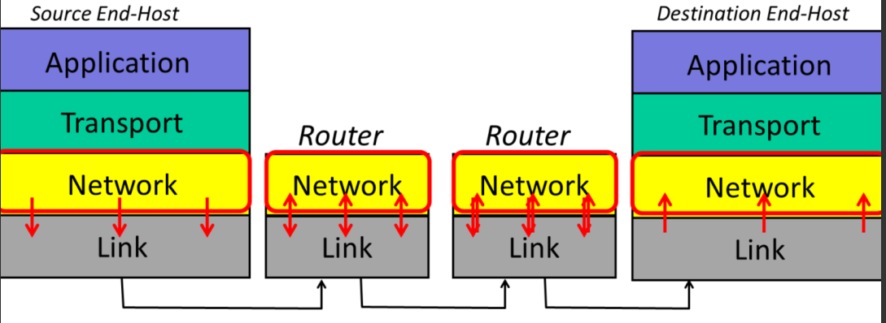
    The Network hands the datagram to the Link layer below, telling it to send the datagram over the first link.
    At the other end of the link is a router. The Link layer of the router accepts the datagram from the link, and hands it up to the Network Layer in the router.
    The Network Layer on the router examines the destination address of the datagram, and is responsible for routing the datagram one hop at a time towards its eventual destination.
    The Network Layer does not need to concern itself with **how** the Link layer sends the datagram over the link.
    This separation of concerns is made possibly by the modularity of each layer and a common well-defined API to the layer below.
  - The network layer is **special**
    We must use the Internet Protocol(IP)
    - IP makes a best-effort attemp to deliver our packets to the other.But it makes no promises.
    - IP packets can get lost, can be delivered out of order, and can be corrupted.There are no guarantees.
- Link
  The Internet is made up of end-hosts, links and routers.
  Data is delivered hop-by-hop over each link in turn.
  Data is delivered in packets. A packet consists of the data we want to be delivered, along with a header that tells the network where the packet is to be delivered, where it came from and so on.
  The Link Layer's job is to carry the data over one link at a time. Ethernet and WiFi is two examples of different Link layers.
  The Link Layer is providing a **service** to the Network Layer. Receive a datagram to send, transmit it over one link for you.

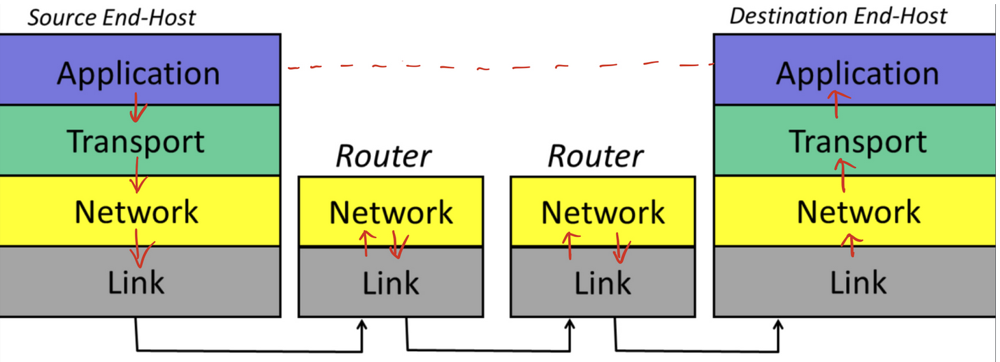
- Application Layer: It talks to its peer layer at the destination. When the application has data to send, it hands the data to the Transport layer.
- Transport Layer: It has the job of breaking the data into packets, each with the correct destination address. Finally, the packets are handed to the Link Layer.
- Network Layer: The data makes its way, hop by hop, form one router to the next. The Network Layer forwards it to the next router, one at a time, uitl it reaches the destination.
- Link Layer: It has the responsibility of delivering the packet from one hop to the next along its path.

|Layer|What does it work?|
|:---:|:---|
|Application|Bi-directional reliable byte stream between two appliactions, using application-specific semantics(e.g. http, bit-torrent)|
|Transport|Guarantees correct, in-order delivery of data end to den. Controls congestion(拥塞).|
|Network|Delivers datagrams end to end.Best-effort delivery -no guarantees.Must use the Internet Protocol(IP).|
|Link|Delivers data over a single link between an end host and router, or between routers|

- IP is the "thin waist"
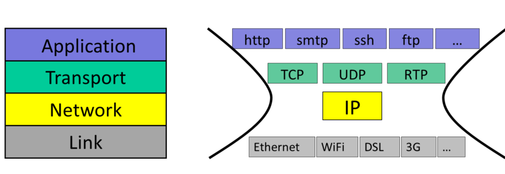
- The 7-layer OSI Model
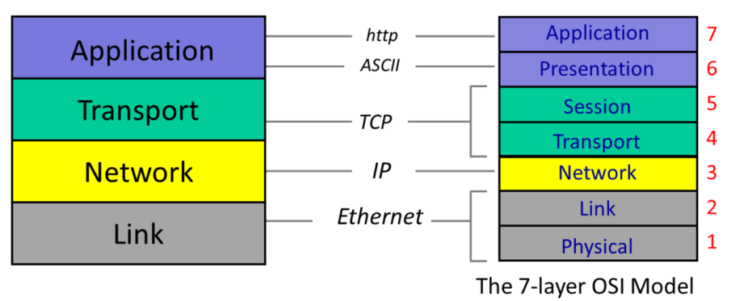
## 1.4 The Internet protocol
- What IP does for us?
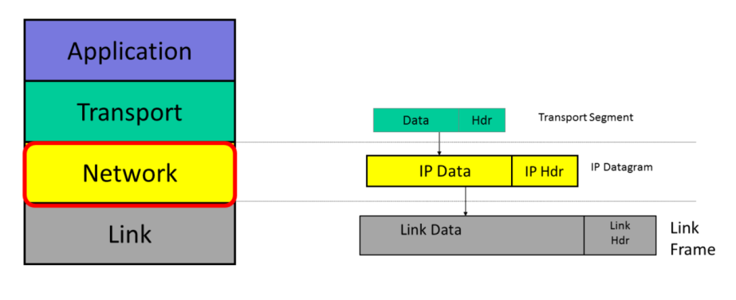
IP datagrams consist a header and some data. When the transport layer has data to send, it hands a Transport Segment to the Network Layer below.
The network layer puts the transport segement inside a new IP datagram. IP's job is deliver the datagram to the other end.
Firstly, the IP datagram has to make it over the first link to the first router.
IP sends the datagram to the Link Layer.
- How it works?
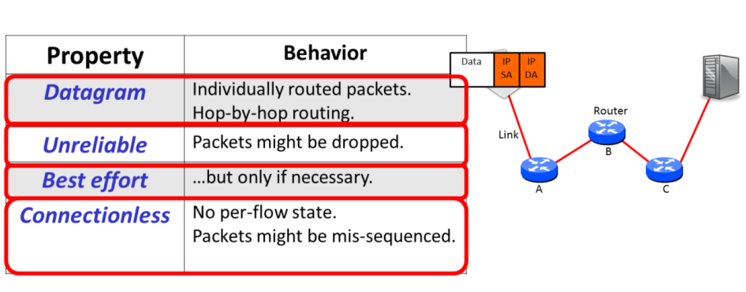
  - Datagram
    1. IP is a datagram service. When we ask IP to send some data for us, it creates a datagram and puts our data inside. (The datagram is a packet that is routed individually through the network based on the information in its header, the datagram is self-contained.)
    2. The header of datagram contains IP DA(IP destination address) and IP SA(IP source address), so the receiver knows where to send any response.
    3. Datagram are routed hop-by-hop through the network from one router to the next, all the way from IP SA to IP DA.
    4. Each router contains a forwarding table that tells it where to send packets matching a given destination address. (The router doesn't know the whole path — it simply uses the destination address to index into its forwarding table so that it can forward the packet to the next hop along the path towards its final destination).
  - Unreliable
    1. IP makes no promise that packets will be delivered to the destination.
    2. The packet could be delivered late, out of sequence, or never delivered at all.
  - Best Effort
    1. IP does make the promise to only drop datagrams if necessary. (For example, the packet queue in a router might fill up because of congestion, forcing the router to drop the next arriving packet. IP won't make any attempt to resend the data — in fact, IP doesn't tell source that the packet was dropped.)
    2. IP does make promise to only make these errors then necessary.
    3. IP is an extremely simple, minimal service. It maintains no state at all related to a communication. We say that a communication service is "connectionless".
    4. When we make a Skype call lasting several minutes and consisting of many IP datagrams, the IP layer maintains no knowledge of the call, and simply routes each datagram individually and independently of all the others.
- Why is the IP service so simple
    - Simple, dumb, minimal: Faster, more streamlined and lower cost to build and maintain.
    - The end-to-end principle: Where possible, implement features in the end hosts.
    - Allows a variety of reliable (or unreliable) services to be built on top.
    - Works over any link layer: IP makes very few assumptions about the link layer below.
- The IP Service Model(Details)
  1. Tries to prvent packets looping forever
  2. Will fragment packets if they are too long
  3. Uses a header checksum to reduce chances of delivering datagram to wrong destination
  4. Allow for new versions of IP
     - Currently IPv4 with 32 bit addresses
     - And IPv6 with 128 bit addresses
  5. Allows for new options to be added to header
- IPv4 datagram
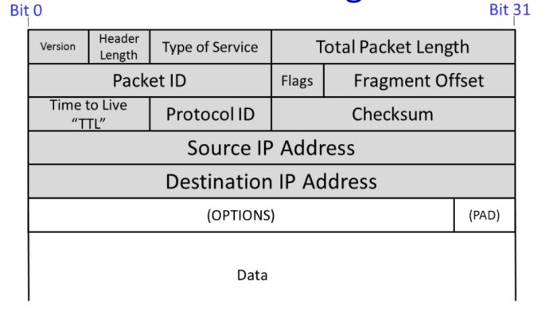
  The most improtant fields in the IP header are:
  1. IP DA
  2. IP SA
  3. The Protocol ID: representing different transport protocols. It tells us what is inside the data field. Protocol ID == 6, the data contains a TCP Segment.
  4. The Version: IPv4 and IPv6, versions of IP.
  5. The Total packet length: It can be up 64kB including the header and all the data.
  6. The "Time to Live": It helps us to prevent packets accidentally looping in the ntwork forever.
  7. The Packet ID, Flags and Fragment Offset: All help routers to fragment IP packets into smaller self-contained packets if need-be.
  8. The Type of Service: It gives a hint to routers about how important this packet is.
  9. The Header Length tells us how big the header is --- some headers have optional extra fields to carry extra information.
  10. The Checksum: It is calculated over the whole header so just in case the header is corrupted, we are not likely to deliver a packet to the wrong desination by mistake.
## 1.5 Life of a Packet
  Applcation Layer --> a stream of data --> Transport Layer --> segments of data --> Network Layer --> datagram -- > Link layer --> next router Link layer ...
- TCP Byte stream
  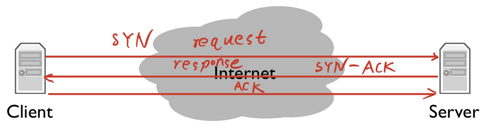
  Recall that the network layer is responsible for delivering packets to computers, but the transport layer is responsible for delievering data to applications. To open a TCP stream to another progra, we need two addresses:
  1. IP address -- host-end
  2. TCP Port -- application
- Inside the Stream
  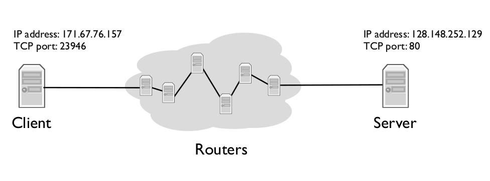
  IP packets between the client and server take many "hops", where a hop is a link connecting two routers.
  A router can have many links connecting it. As each packet arrives, a router decides which of its links to send it out on. (Router have IP addresses, so it can deliver the packet to its own software. For example, when you log into a router using TCP, the IP packets are destined to the router's own IP address).
- Inside Each Hop
  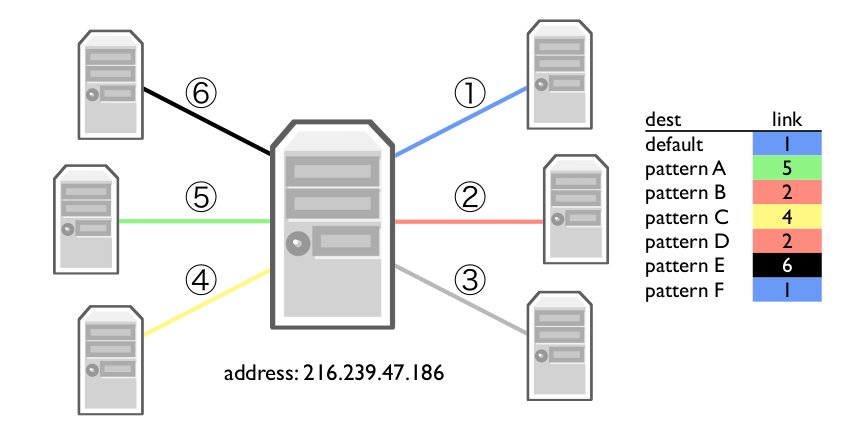
  How does a router make this decision? It does so through something called forwarding table, shown here on the right. A forwarding table consists of a set of IP address and the link to send across for each pattern.
  The patterns contains a default pattern, the first entry in the table above. When a packet arrives, the router checks which forwarding table entry's pattern best matches the packet. "Best" means the most specific match.
  The default route is especially useful in edge networks.
- Under the Hood
  - Request web page from www.cs.brown.edu
  - Use wireshark to see TCP byte stream establishment and data exchange
  - Use traceroute to see route packets take through Internet
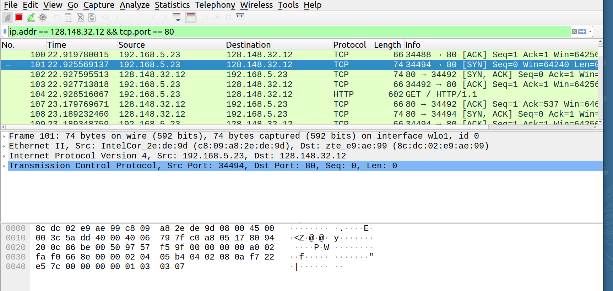
This is how the network looks like to the end hosts, the computers, as they exchange packets at the network layer.
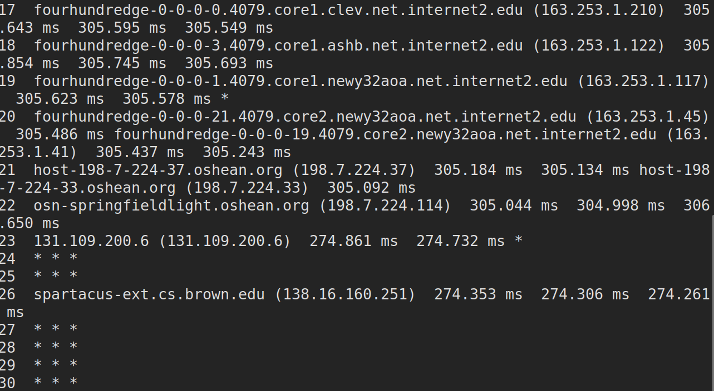
We can see to visit www.cs.brown.edu, the packet via 30 hops.
## 1.6 Basic architectural ideas and principles
- Packet switching
  - What is Packet switching
    - **Packet:** A self-contained unit of data that carries information necessary for it to reach its destination.
    - **Packet switching:** Independently for each arriving packet, pick its outgoing link. If the link is free, send it. Else hold the packet for later.

  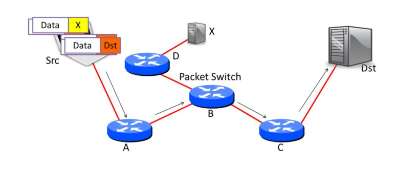
  In packet switching, there is no dedicated circuit to carry our data.
  A packet switched network consists of end-hosts, links, and packet switches. When we send a packet, it is routed hop-by-hop to its destination. Each packet switch lookups the address in the packet header in its local forwarding table.
  - Two consequences
    1. Simple packet forwarding
       A switch can make individual, local decisions for each packet. **Even if many packets are part of some larger transfer or protocol, the switch doesn't need to know or care.** This greatly simplifies the switch.
    2. Efficient sharing of links
       A switch efficiently share a link between many parties.
  - No per-flow state required
    - **Flow:** A collection of datagrams belonging to the same end-to-end communication, e.g. a TCP connection.
    - Pcaket switches don't need state for each flow - each packet is self-contained.
      Treating each packet independently means the switch can be much simpler to build, manage, and troubleshoot.
    - The switch doesn't need to worry about adding or removing the per-flow state.
    - The siwtches also don't need to store this state. This lets switches focus on forwarding packet quickly.
    - The switched don't have to worry about faiures. The switch is more functionally independent of the computers sending traffic through it.
  - Efficient sharing of links
    - Date taffic is bursty
      - Packet switching allows flows to use all available link capacity
      - Packet switching allows folws to share link capacity
    - This is called Statistical Multiplexing
  - Summary
    - Packet switches are simple
    - Packet switching is efficient
- Layering
  - features
    - Each layer provides a well-defined service to the layer above, using the services provided by layers below and its own private processing.
    - Layers are functional components.
    - Layers communicate sequentially with the layers above and below.
  - Reason for layering
    - Modularity
    - Well defined service
    - Reuse
    - Separation of concerns
    - Continous improvement
    - Peer-to-Peer communications
- Encapsulation(封装)
  Encapsulation is the result of what happens when you combine layers and packet switching. We want to break up our data into discrete units, called packets.
  - From Layering
    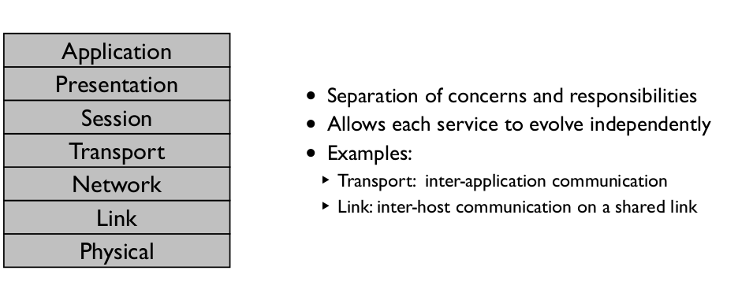
    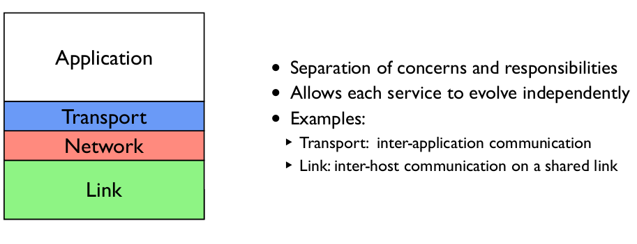
  - Encapsulation
    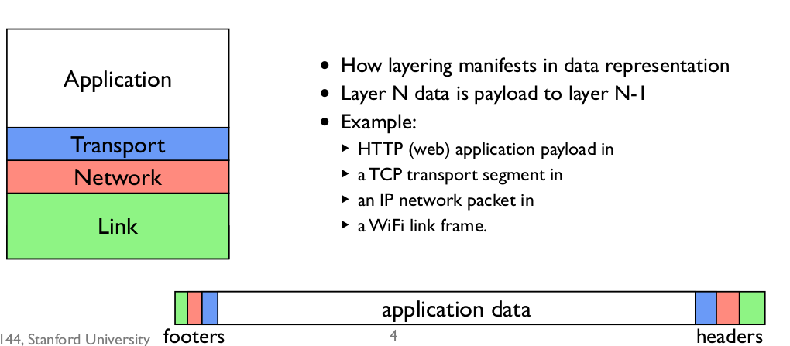
    Encapsulation is the principle that let us take protocol layers and let them easily share the storage within a packet.
    In the draw, the packet's headers is on the right. As a router or switch send a packet, we draw the packet moving from left to right. So the first bit to leave the router or switch is at the far right.
    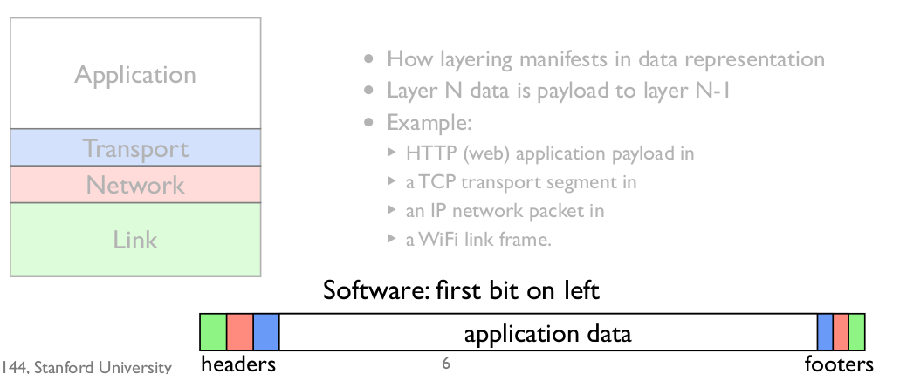
    This approch comes from software. The idea is that the begining of the packet comes at address zero.
    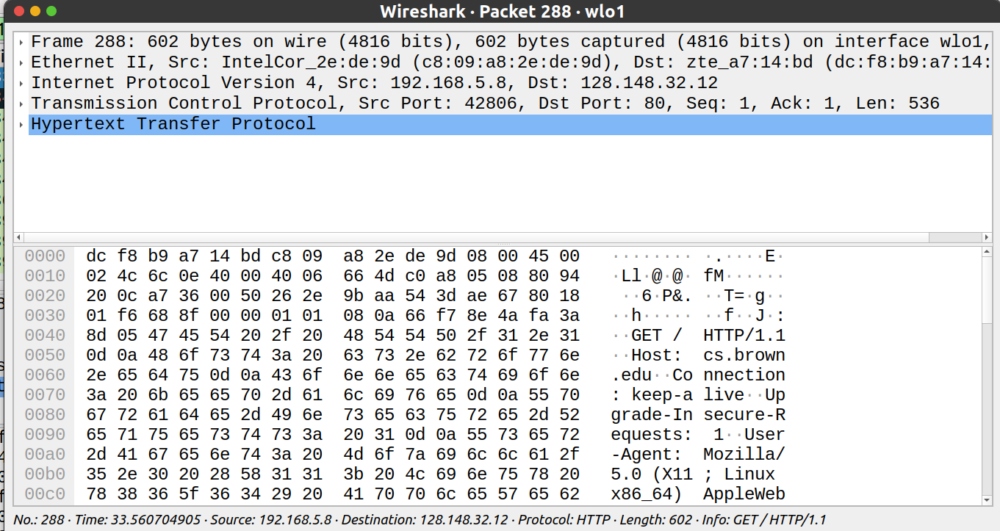
    We can see the Ethernet frame, inside which is an IP packet, inside which is a TCP segement, inside which is a HTTP GET.
  - Encapsulation Flexibility
    - Encapsulation allows you to layer recursively(递归)
    - Example： Virtual Private Network(VPN):
      - HTTP(web) application payload in
      - a TCP transport segment in
      - an IP network packet in
      - a secured TLS presentation message in
      - a TCP transport segment in
      - an IP network packet in
      - an Ethernet link frame
       You do this with a gateway.
    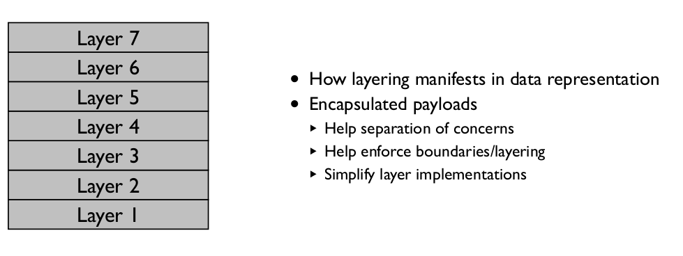
## 1.7 Memory Byte Oreder and Packet Formats
- Memeory
  To generate a message to send, software typically has to create a copy of it in memoey, which it then passes to the networking card. Similarly, when a computer receives a message, the networking card puts that message in memory, which software can then access.
  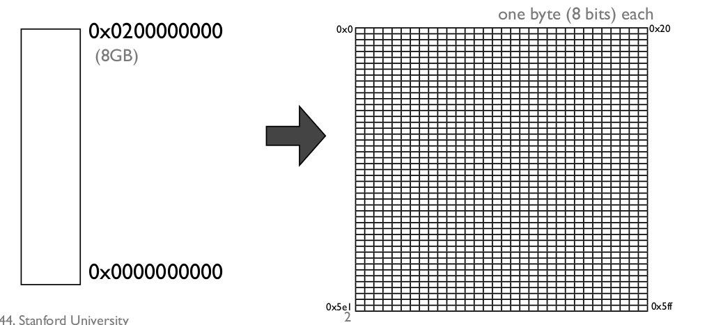
  In most computers today, memory is organized in terms of byte: 8 bit chunks of memory. Most computers today are 64 bits, so a computer has up to 2^64 bytes, or 10^18 bytes. In pratice, computers today don't have this much memory.
  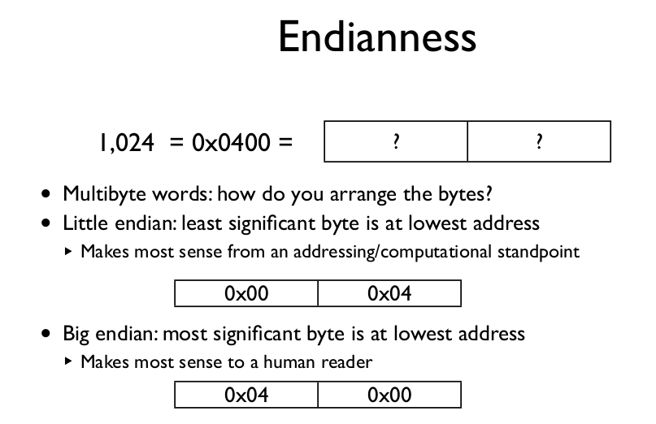
  How you lay out a multibyte value in memory is called endianness, and there two options.
  - little endian: The least significant byte is at the lowest address. It from a computational and architectural standpoint.
  - big endian:The most significant byte is at the lowest address. It make more sense to a human reader.
  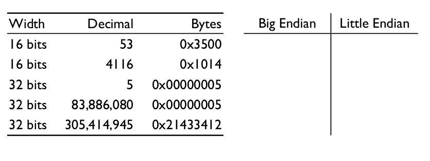
  53 is little endian, 53 is 0x00 and 0x35, so little endian is 0x3500.
  4116 is big endian, 4096 is 0x10 and 0x14, so big endian is 0x1014.
  5 is big endian, 5 is 0x0000 and 0x0500, so big endian is 0x00000005.
  83886080 is little endian, 83886080 is 0x0005 and 0x0000, so little endian is 0x00000005.
  305414945 is little endian, Since 305414945 is odd, the least significant is 0x21 or 0x12, and the least significant should is 0x21, so this is little endian.
- Byte Order
  - Network Byte Order
    - different processors have different endianness
      Little endian:x86, big endian: ARM
    - To interoperate, they need to agree how to represent multi-byte fields
    - Network byte order is big endian
      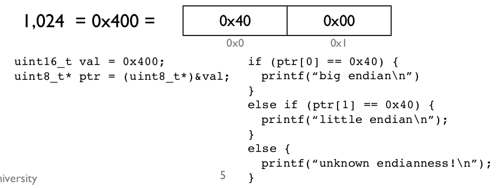
  - Portable Code
    - You have to convert network byte order values to your host order
    - packet has a 16-bit port in network byte order, you're using a struct to access it, you wan to check on your x86 processir if the port is 80.
      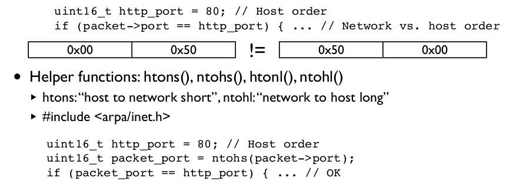
    To make this easier, C networking libraries provide utility functions that convert between host order and network order. The function htons() for example, take a host short, 16-bit, value as a parameter and returns a value in network order. l means long 32 bit of values.
  - Be careful whenever you handle network data. Otherwise you will waste many (avoidable) hours debugging your code due to forgetting to converting twice.
- Packet Formats
  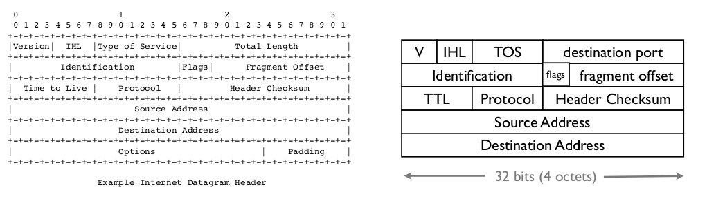
  The total lentgh field of an IPv4 packet is 2 bytes, which means an IPv4 packet can't be longer than 65535 bytes.
## 1.8 Names and Address:IPv4
- Goal of Internet Protocol Addresses
  - Stitch many different networks together
  - Need network-independent, unique address
    Today, IPv4 addresses are a bit more complicated, they're not totally unqiue due to a bunch of special cases and uses, but for now let's just assume they're unique.
- Internet Protocol Version 4
  - An IPv4 address indentifies a device on the internet
    - Layer 3(network) address
  - 32 bits long (4 octets):a.b.c.d
    - Example: 171.64.64.64
    - Example: 128.30.76.82
    - Example: 12.22.58.30
  - Netmask: apply this mask, if it matches, in the same network
    - Netmask of 255.255.255.0 means if the first 24 bits match
    - Netmask of 255.255.252.0 means if the first 22 bits match
    - Netmask of 255.128.0.0 means if the first 9 bits match
    - Smaller netmask(fewer Is) means larger network
  In addition to an address, a device typically also has something called a netmask(A netmask tells the device which IP addresses are local--on the same link--and which require going through an IP router). It can, in theory, just send the packet directly to the other device since it's on the same link.
  You tell whether two computers are in the same network by taking a bitwise AND of their addresses with the netmask. If the resulting addresses are euqal, they are in the same network.
  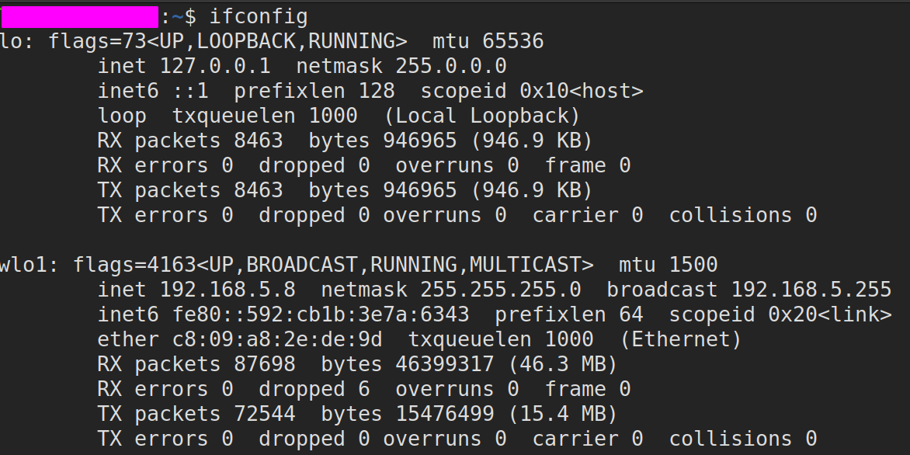
  My computer is connected to the Internet over WiFi, which happenes to be the link named "wlo1", and my IPv4 address is 192.168.5.8, netmask 255.255.255.0. This means that if I send an IP packet to an address beginning with 192.168.0.0, I should send it directly, but if it doesn't begin with 192.168.0.0, I need to send it throught a router.
  
- Address Structure(historical)
  - Originally hierarchical: network + host
    - Network to get to correct network(administrative domain)
    - Host to get to correct device in network(within administrative domain)
  - Originally 3 classes of addresses: class A, class B, class C
  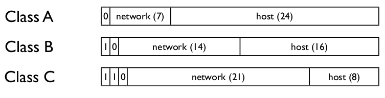
  Class A addresses had a leading 0, 7 bits of network(for 128 networks) and 24 bits of host, so could cover 16 million computers.
  Class B addresses had 16 bits of host, so could cover 65,536 computers.
  Class C addresses had 8 bits of host, so could cover 256 computers.
- Address Structure Today
  - Still assign contiguous ranges of addresses to nearby networks
    - Class A, B, C is too coarse grained(e.g., MIT dorms!)
    - http://news.stanford.edu/news/1999/january27/itss127.html
  - Classless Inter-Domain Routing(CIDR)
    - Address block is a pair: address, count
    - Counts are powers of 2, specify netmask length
    - 171.64.0.0/16 means any address in the range 171.64.0.0 to 171.64.255.255
    - A /24 describes 256 addresses, a /20 describes 4096 addresses
  - Standford today has 5 / 16 blocks -- 325,000 addresses
  Today, IPv4 addresses are structed though something called CIDR, or Classless Inter-Domain Routing. Rather than have prifixes only of length 8, 16, and 24 bits, CIDR allow prefixes to be any number of bits. This means all CIDR prefixes define a block of addresses that is a power of 2 in size. When we talk about a CIDR address, we refer to its netmask length.
  Standford today has 5 /16 blocks, 5 * 2 ^ (32 - 16)个， 近似为 325,000 IPv4 addresses.
- IPv4 Address Assignment
  - IANA: Internet Assigned Number Authority
    - Internet Corpotation for Assignment of Names and Numbers(ICANN)'s job
  - IANA gives out /8s to Reginoal Internet Registries(RIRs)
    - Ran out in Fabruary 2011, in special and case of giving I to each RIR
  - RiRs responsible for geographic regions, each has own policy
    - AfriNIC: Africa
    - ARIN: U.S.A, Canada, Carribean, Antarctica
    - APNIC: Asia, Australia, New Zealand
    - LACNIC: Latin America, Carribean
    - RIPE NCC: Europe, Russia, Middle East, Central Asia
## 1.9 Longest Prefix Match
To select which link to forward a packet over, routers today typically use an algorithm called Longest Prefix Match.
- Inside the Stream
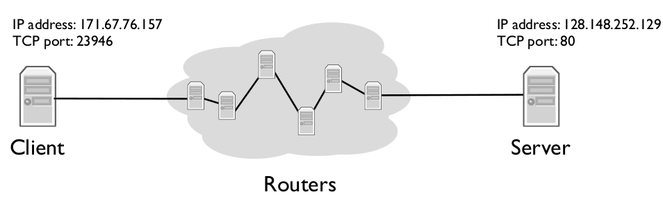
On each hop of packet, a rotuer decides which link to forward the packet over.
- Inside Each Hop
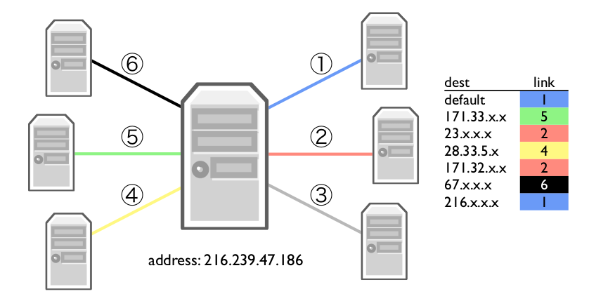
A router makes this decision through something called a forwarding table, shown here on the right.
A forwarding table consists of a set of partial IP addresses. The x's show that the addresses are partial. The x's represent wildcards.
When a packet arrives, the router checks which forwarding table entry best matches the packet and forwards the packet along the link associated with that forwarding entry.
- LPR
  - Algorithm IP routers use to chose matching entry from forwarding table
  - Forwarding table is a set of CIDR entries
    - An address might match multiple entries
    - E.g., 171.33.0.1 matches both entries on right
  - Algorithm: use forwarding entry with the longest mathcing perfix
    - Longes prefix match will chose link 5 for 171.33.0.1
- Inside Each Hop(for real)
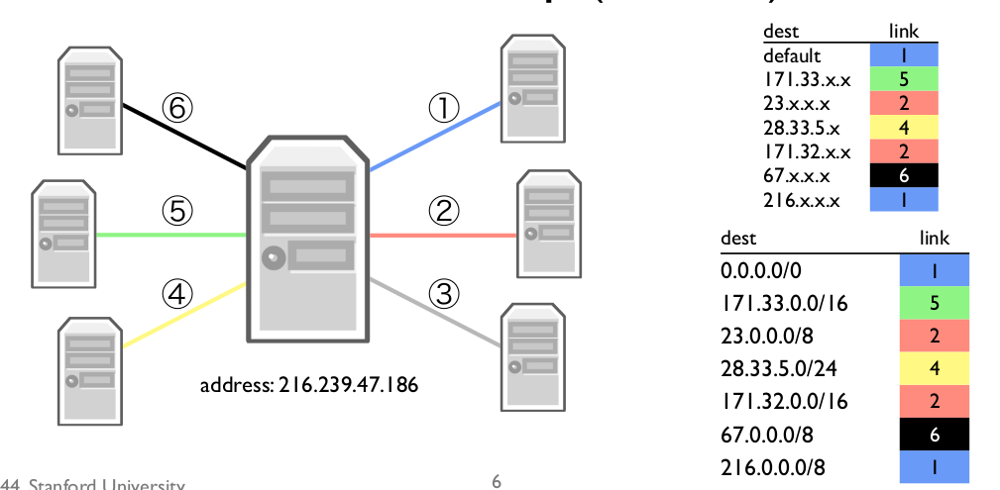
- Quiz
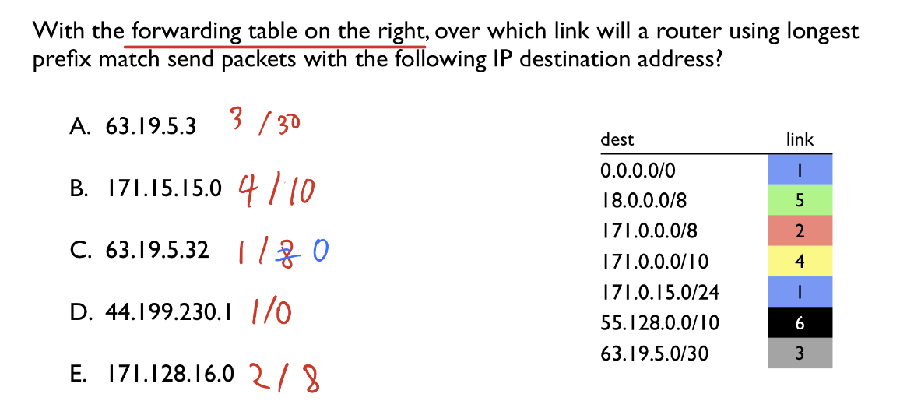
## 1.10 Address Resolution Protocol
The Address Resolution Protocol, or ARP, is the mechansim by which the network layer can discover the link address associated with a network address it's directly connected to.
ARP is needed because each protocol layer has its own names and addresses.
An IP address is a network-level address. It describes a host, a unique destination at network layer.
A link address, in contrast, describes a particular network card, a unqiue device that sends and receives link layer frames.
- Addressing Problem
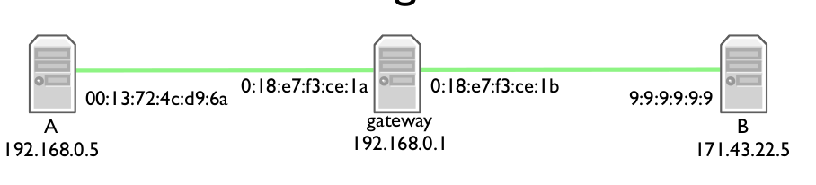
The gateway or router has mutiple interfaces, each with their own link layer address to identify the card, and also each with their own network layer address to identify the host within the network that card is part of.
The fact that link layer and network layer addresses are decoupled logically but coupled in pratice is in someways a historical artifact.
- Encapsulation
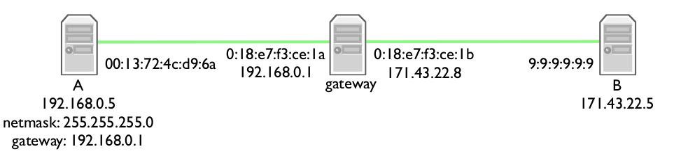
Node A sends a packet to node B:
  1. A checks whether the destination address is the same network. The network mask tell its not.
  2. So node A needs to send packet through gateway, 192.168.0.1, so the packet network layer destination address is 171.43.22.5, link layer destination address is the link layer address of gateway(0:18:e7:f3:ce:1a)
  3. An packet from A to B, encapsulated inside a link alayer from A to the left gateway interface.
  4. The packet arrives the gateway, the gateway looks up the next hop, decides it's node B.
  5. Put the packet inside a link layer frame to B. So the second IP packet from A to B is inside a link layer from the right gateway interface to B
- Example problem
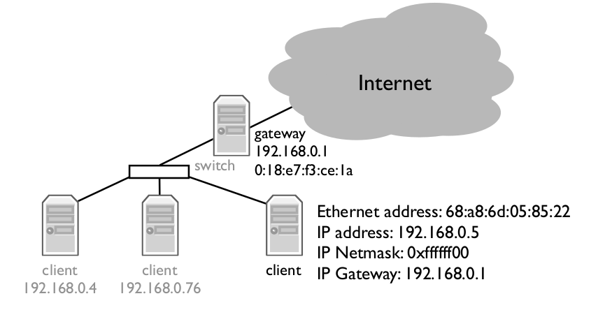
To send a packet through the gateway that has IP address
192.168.0.1, it needs to have the link layer address associated with 192.168.0.1.
We can be able to map a layer3(network layer) address, to its corresponding layer 2, link layer address. We do this with a protocol called ARP, or the Address Resoultion Protocol.
- Address Resolution Protocol
  - Generates mappings between layer 2 and layer 3 addresses
    - Nodes cache mappings, cache entries expire
  - Simple request-reply protocol
    - "Who has network address X?"
    - "I have network address X."
  - Request sent to link layer broadcast address
  - Reply sent to requesting address
  - Packet format includes redundant data
    - Request has sufficient information to generate a mapping
    - Makes debugging much simpler
  - No "sharing" of state: bad state will die eventually
  A node needs to send a packet to an IP address:
  1. Check whether the node has mapping this IP address, is --> send, no --> step 2
  2. The node send a request: "Who has network address X?"
  3. The node that has that network address responds, saying "I have network address X". The response includes the link layer address.
  4. Requester receiving the response, generates the mapping and send the packet.
- ARP Packet Format(RFC826)
  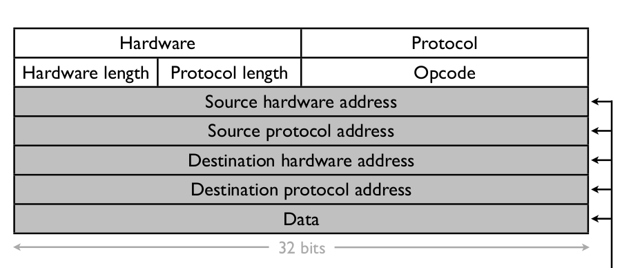
  This is what an ARP packet actually looks like. It has 1- fields. The hardware field states what link layer this request or response is for. The protocol field states what network protocol this request or response is for.
  The opcode specifies whether the packet is a request or response.
  all of these field are stored in **network order-big endian**.
- ARP Request
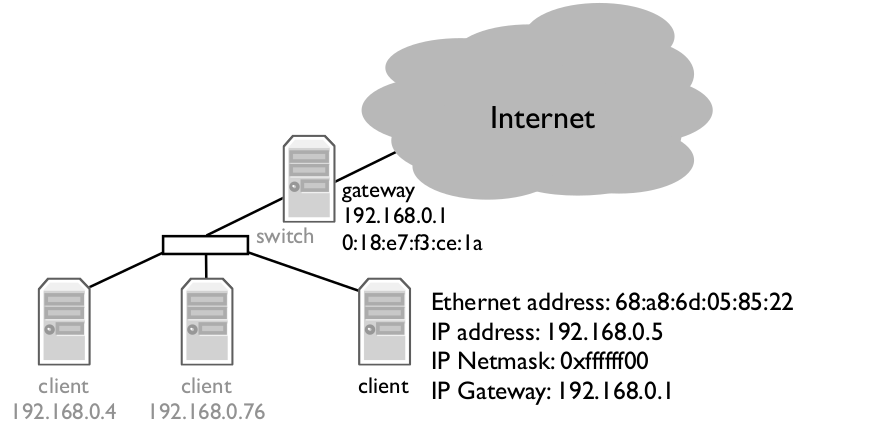
  - client generate an ARP request packet.
    Hardware: Ethernet -- 1
    Protocol: IP -- 0x0800
    Hardware lentgh: 6
    Protocol lentgh: 4
    The opcode: request -- 1
    Source hardware address: 68:a8:6d:05:85:22
    Source protocol address: 192.168.0.5
    Destination hardware address: ff:ff:ff:ff:ff:ff
    Destination protocol address: 192.168.0.1
- ARP Reply
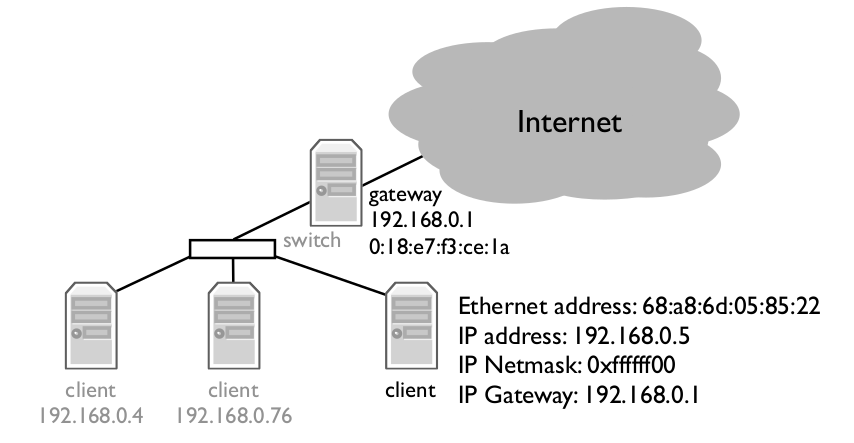
  - gateway generate an ARP response packet.
      Hardware: Ethernet -- 1
      Protocol: IP -- 0x0800
      Hardware lentgh: 6
      Protocol lentgh: 4
      The opcode: response -- 2
      Source hardware address: 0:18:e7:f3:ce:1a
      Source protocol address: 192.168.0.1
      Destination hardware address: 68:a8:6d:05:85:22
      Destination protocol address: 192.168.0.5
# 2. Transport Layer
## 2.1 The TCP Service Model
- Transport Control Protocol
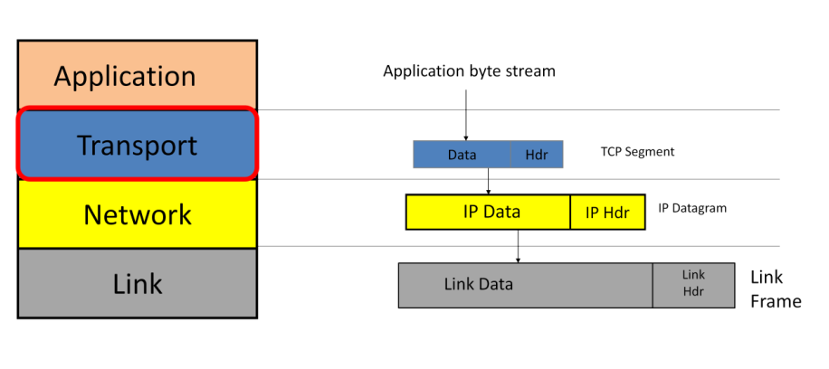
Some bytes data --- TCP ---> TCP segment --- IP layer ---> IP datagram --- Link layer ---> link frame
- Peer TCP layers commnuicate
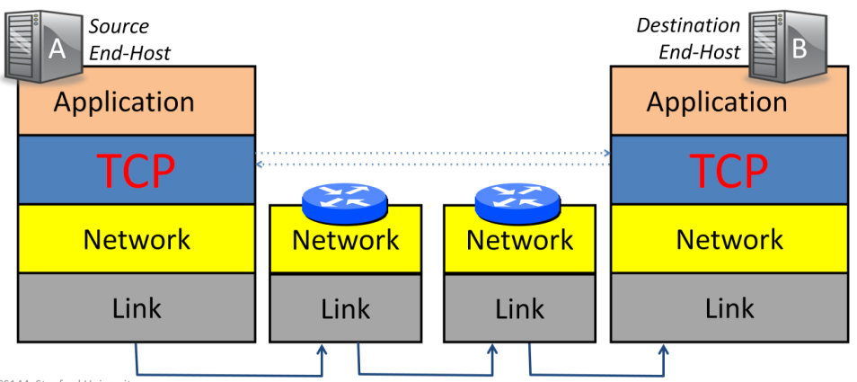
When two applications use TCP, they establish a two-way communication channel between the TCP peers at both ends.
First, TCP establishes a communication channel from A to B
Then, it establishes a communication channel from B to A
We call the two way communication a "connection". At both ends of the connection, TCP keeps a **state machine** to keep track of how the connection is doing.
- Connection setup 3-way handshake

The TCP connection is established using a 3-way handshake between hosts A and B.
1. HostA send a SYN message to HostB(A also sends along the base number it will use to identify bytes in the byte stream)
2. B responds with SUN+ACK. ACK is B acknowledging A's request and agreeing to establish the communication from A to B. SYN indicates B wants to establish the communication with the TCP layer at A. It sends a number too, indicating the starting number for the byte stream.
3. A responds with an ACK to indicate that it is accepting the request for communication in the reverse direction.
- TCP "stream of bytes" service
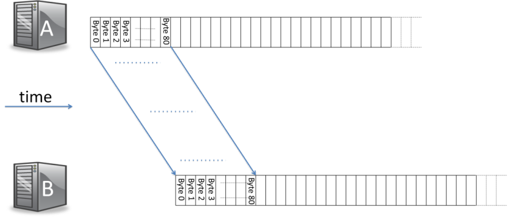
The hosts send data to each other as if it is from a continuous stream of bytes.
- ... emulated using TCP "segments"
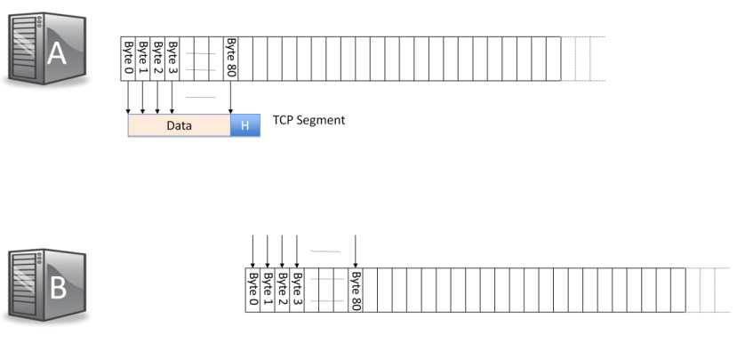
The TCP segment data can be a small as 1 byte - for example if you are typing characters in an ssh session, each character is sent one at a time. This isn't very efficient.
Efficient way: We can fill the TCP segment all the way up to the maximum IP datagram size.
- Connection teardown
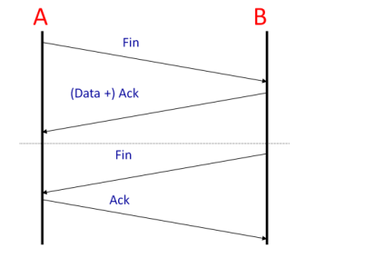
When A and B have finished sending data to each other, they need to close the connection.
1. The TCP layer at Host A sending a FIN message.
2. Host B acknoledges that A no longer has data to send and stops looking for new data from A. B might still have new data to send to A. So B send the ACK that can also carry new data from B to A.
3. B finshes send data to A. B sends its own FIN to tell A they can close the connection.
4. A replies by sending an ACK to B.

|Property|Behavior|
|---:|:---|
|Stream of bytes|Reliable byte delivery service|
|Reliable delivery|1. Acknowledgments indicate correct delivery.  2. Checksums detect corrupted data.  3. Sequence numbers detect missing data.  4. Flow- contorl prevents overrunning receiver.|
|In-sequence|Data delivered to application in sequence tansmitted|
|Congestion Control|Control network congestion|

- The TCP Segment Format
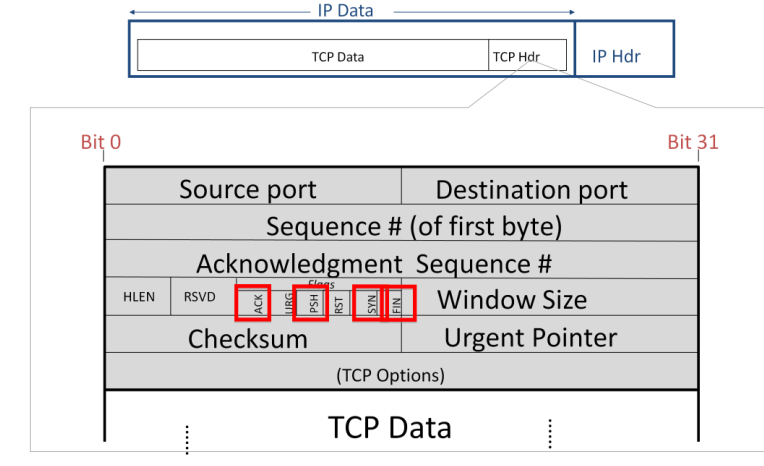
Sequence number indicates the postion in the byte stream of the first byte in TCP Data field.
Acknowledgment Sequence number tells the other end which byte we are expecting next. Notice that there are sequence numbers for both directions in every segment. This way, TCP piggybacks acknowledgments on the data segments traveling in the other direction.
The Header Length field tells us how long the TCP header is.
The TCP Options fields are new header field. The HLEN tells us how many option fields are present, ussually there are none.
A bunch of Flags:
ACK flags tells us that the Acknowledgments sequence number is valid and we are acknowledging all of the data up until this point.
SYN flags tells us that we are signalling a synchronize, which is a part of the 3way handshake.
FIN flags signals the closing of one direction of the connection.
PSH flags tells the TCP layer at the other end to deliver the data immediately upon arrival, rather than wait for more data.(This is useful for short segments carrying time critical data, such as a key storke)

- The Unique ID of a TCP connection
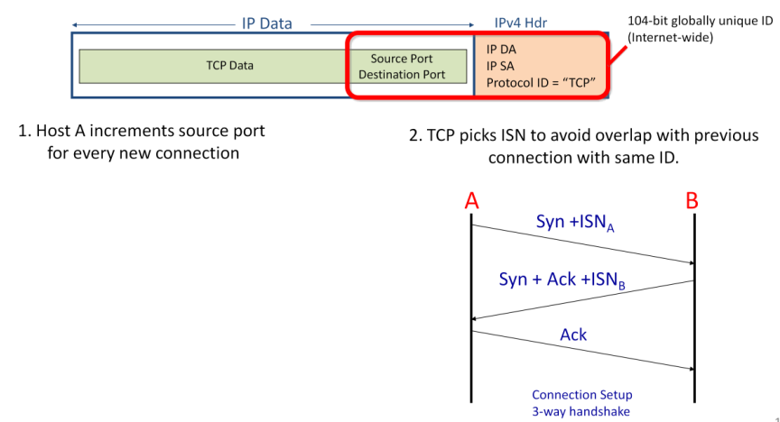
A TCP connection is uniquely identified by five pieces of information in the TCP and IP header.
IP address is unique, TCP port is unique.
We need to make sure it doesn't accidentally pick the same source port number it is already using with another connection to the same service on Host B.
Host A uses a simple methode to minimize the chances:
1. Increment the source port number for every new connection.
TCP
2. The TCP connections intialize with a random initial sequence number to refer to bytes in the byte stream
- Sequence Numbers
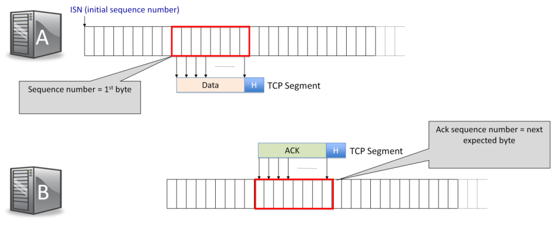
The sequence number in a segment from A to B includes the sequence number of the first byte, offset by initial sequence number.
The acknowledgment sequence number in the segment from B back to A tells us which byte B is expecting next, offest by A's initial sequence number.
- TCP: Port Demultiplexing
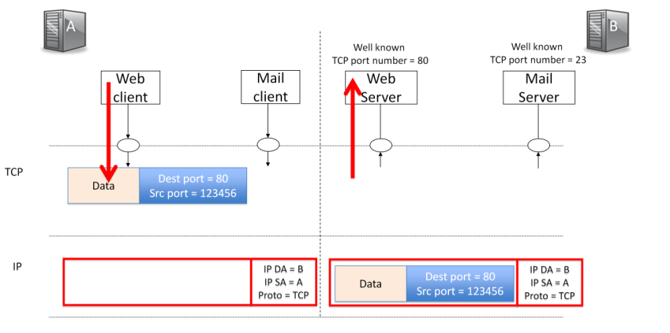
- TCP Sliding Window
You will learn about other TCP features in upcoming vedios:
  - Window-based flow control
  - Retransmission and timeouts
  - Congestion control
## 2.2 The UDP Service Model
- The UDP Datagram Format

The UDP header is small, because the service it offers the application is very simple.
- UDP:Port Demultiplexing
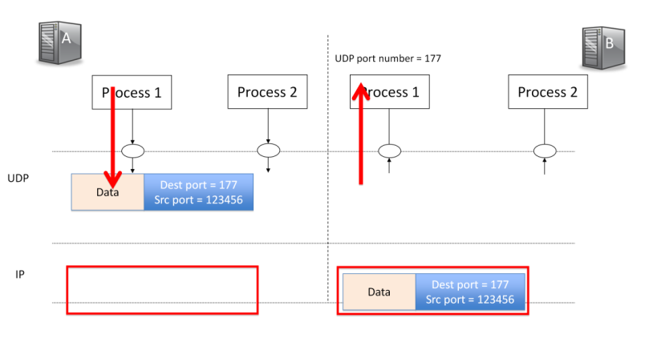
Port numbers in UDP work the same way as in TCP.
- UDP Datagram Protocol(UDP)

|Property|Behavior|
|---:|:---|
|Connectionless Datagram Service|No connection estabilshed. Packets may show up in any order.|
|Self contained datagrams|IP similarly|
|Unreliable delivery|1. No acknowledgments. 2. No mechanism to detect missing or mis-sequenced datagrams 3. No flow control.|
  - The UDP is connectionless, all of information is self-contained. It means packet may show up in an any order.
  - UDP is offering little more than a  simple wrapper on top of the IP layer
  - UDP usually is used by applications that don't need reliable delivery, such as DNS - the domain name system used by the Internet to turn a hostname into an IP address. The DHCP or Dynamic Host Configuration Protocol also uses UDP， DHCP helps a new host find out its IP address when it joins a network.
UDP provides a simpler, datagram delivery service between application processes.
## 2.3 The Internet Control Message Protocol(ICMP) Service Model
- Making the Networking Layer Work
  1. The Internet Protocol(IP)
   - The creation of IP datagrams
   - Hop-by-hop delivery form end to end
  2. Routing Tables
   - Algorithms to populate router forwarding tables
  3. Internet Control Message Protocol
   - Communicates network layer information between end hosts and routers
   - Reports error conditions
   - Help us diagnose problems
- ICMP runs above the Network Layer
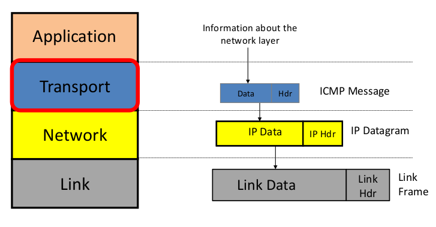
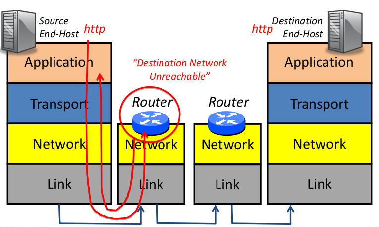

|Property|Behavior|
|---:|:---|
|Reporting Message|Self-contained message report error.|
|Unreliable|Simple datagram service-no retries.|
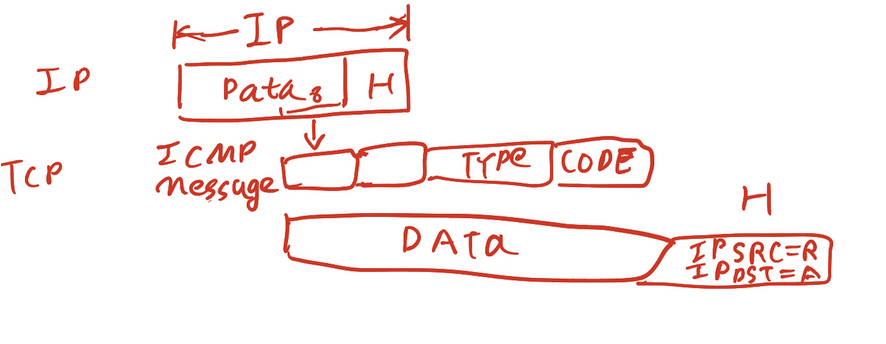
- ICMP Message Types

- How "ping" uses ICMP


- How "traceroute" uses ICMP


- Summary
  - ICMP provides information about the network layer to end hosts and layers
  - It sit above IP and is therefore strictly a transport layer mechanism
  - used tools ping and traceroute rely on ICMP
## 2.3 The End-to-End Princinple
The end-to-end principle holds a vety special place in design of the Internet. This is because it really refers to two different principles:
1. The first deals with correctness
2. strong end-to-end principle, is much broader and general

- Application View of the world
  Our application opens a connection between A and B. It reads a file on computer A and writes it to TCP connection. B reads the data from the socket and writers the data to a file on computer B.
  The network in this case does very little. Forwarding packet from A to B. A and B set up the connection, and the application reads and writes the data.
- Why Doesn't Network Help?
  - Compress data
    The network could automatically compress(压缩) pakets between A and B, If the file is plain English text, this could reduce transfer size tenfold.
  - Reformat/translate/improve requsest?
    combine the two transfer into a single request.
  - Serve cached data
    the computer C has A's file, and C is closer and faster to B than A, the network could transfer the file from C ranther than A.
  - Add security?
    the Network if encrypt data for us, we don't have to worry it in our application.
  - Migrate connections across the network?
    The network could add mobility support, so that as computer A moves through a network, routes automotically update and packets contine to flow to it.
  - Or one of any of a huge number of other things?
The network could possibly do all kinds of things to help. But thats's all it can do -- help. If the system is going to work correctly, then the end points need to **be responsible for making sure it does**.
- Example: File Transfer

  File data is going to pass through several computers C, D, and E. Each link -- source to C, C to D, D to E, and E to destination-- has error detection. These error detection can ended up losing a lot of their source code. Hoever, the mistake buggy memory in storage can pass E's check, because error detection occurs on the link.
  So the only way to be sure the file arrives correctly is to perform an end-to-end check, usually hash.
- Example: Link Reliability
  TCP will work correctly -- it will reliably transfer data -- without this link layer help. But the link layer help greatly improves TCP's performance.
  So that's the end-to-end principle. For something to work correctly, it has to be done end-to-end. You can do stuff in the middle to help as performance improvements, but if you don't rely on end-to-end then at some point it will break.
- "Strong" End to End
  "The network's job is transmit datagrams as efficiently and flexibly as possible. Everything else should be done at fringes..."
  The network performs better and better but becomes harder and harder to change.
## 2.4 Error Detection:3 schemes(Checksum, CRC, and MAC)
Networks today generally use three different error detection algorithms: checksums, cyclic redundancy codes, CRC, and message authentication codes, MAC. Each of them has very different charcateristics.
- Error Detection

We calculate some error detection bits over that data and either append it or prepend it to the payload. Ethernet appends a cyclic redundancy code, Transport Layer Security appends a cyclic redundancy code, and IP prepends a checksum, which it places in the IP header. TLS and Ethernet have a footer, protocol information which follows the payload, which is where they put the CRC and MAC.
- Three Error Detection Schemes
  - Checksums adds up values in packet(IP, TCP)
    - Very fast, cheap to compute even in software
    - Not very robust (have weak guarantees on what errors it will catch)
  - Cyclic redundancy code computes remainder of a polynomial(Ethernet)
    - More expensive than checksum(easy today, easy in hardware)
    - Protects against any 2 bit error, any burst <= c bits long, any odd number of errors
  - Message authentication code: cryptographic transformation of data(TLS)
    - Robust to malicious(恶意的) modifications, but not errors
    - If strong, any 2 messages have a 2^-c chance of having the same code.
  If I have a 16-bits MAC, I am only assured that I'll detect bit errors with very high probability, 99.998 percent, or one in 65536.
- IP Checksum
  - IP, UDP, and TCP use one's complement checksum algorithm:
    - Set checksum field to 0, sum all 16-bits words in packet
    - Add any carry bits back in: 0x8000 + 0x8000 = 0x0001
    - Flip bits(0xc379 becomes 0x3c86), unless 0xffff, then checksum 0xffff
    - To check: sum whole packet, include checksum, should be 0xffff
  - Benefits: fast, easy to compute and check
    - Motivated by earliest software implementations
  - Drawbacks: poor error detection
    - Only guarantees detecting a single bit error
    - Can detect other errors, but actual guarantees are both weak and complex
- Cyclic Redundancy Check(CRC)
  - Cyclic Redundancy Check(CRC): distill n bits of data into c bits, c << n
    - Can't detect all errors: 2^-c chance another packet's CRC matches
  - CRC designed to detect certain forms of errors:stronger than checksum
    - Any message with an odd number of bit errors
    - Any message with 2 bits in error
    - Any message with a single burst of errors <= c bits long
  - Link layers typically use CRCs
    - Fast to compute in hardware(details in a moment)
    - Can be computed incrementally
    - Good error detection for physical layer burst errors
  The idea of CRC is that I want to take n bits of source data and somehow distill(提取) them down into c bits of detection data, where c is much much smaller than N. USB and Bluetooth use 16-bit CRCs.
- Diversion: CRC Mathematical Basis
  - Cyclic Redundancy Check(CRC): distill n bits of data into c bits, c << n
  - Uses polynomical long division
    - Consider the message M a polynomial with coefficients 0 or I(pad with z zeroes)
      E.g., M = 10011101 = x^7 + x^4 + x^3 + x^2 + 1
    - Use a generator polynomial G of degree c also with coefficients 0 or 1
      - Pad first term(always 1) for frustrating historical reasons
      - E.g. G = 1011 = x^3 + x^2 + x + 1
      - USB(CRC - 16) = 0x8005 = x^16 + x^15 + x^2 + 1
    - Divide M by G, the remainder is the CRC: pick G carefully!
  - Append CRC to message M: M' = M + CRC
    - Long division of M' with G has a remainder of 0
- MAC
  - Message Authentication Code(MAC， 消息验证码)
    - Not to be confused with Media Access Control(MAC)!
  - Uses cryptography(密码学) to generate c = MAC(M,s), |c| << |M|
    - Using M and secret s, can verify c = MAC(M,s)
    - If you don't have s, very very hard to generate c
    - Very very hard to generate an M whose MAC is c
    - M + c means the other person probably has the secret(or they're replayed)
  - Cryptographically strong MAC means flipping one bit of M causes every bit in the new c to be randomly 1 or 0(no information)
    - Not as good for error detection as a CRC!
    - But protects against adversaries(对手)
  Likes CRCS, there's a deep and rich mathematical background on how message authentication codes work, so you generalyy want to use an existing scheme rather than invent your own.
- Quiz
  
## 2.5 Finite State Machines
- Example(Three states)

  Edge between the states define how we transition between them. When we draw an edge, we first specify what events cause the transition to occur. Below this we can state what actions the system will take when the transition occur. But you can't have the same event associated with both transitions, otherwise the transition is ambiguous.
- FSM Exapmle: HTTP Request

  The idea is that by specifying only the parts are necessary for interproperability(互操作性)
- FSM Example: TCP Connection

  TCP Connection has 12 states.
  First off, the diagram really has four parts, which we can look separately. These top 4 states are what describe how you open a TCP connection. This center state, "ESTABLISHED" is when TCP is sending and receiving data. It's after the connection has been established but before it's been closed. These 6 states describe how connections close. This state at the bottom, CLOSED, denotes the connection has closed and the node can forget about it.
  Three-handshake:
  1. A client tries to open a connection and send a SYN packet to the server. We can see this first transition for client side of the connection as this orange arrow from CLOSED to SYN SENT state. The client call connect--the event-- client sends a SYN message -- the action.
  2. So once he first SYN is sent, the client is in the SYN SENT state and the server is in the Listen state. When the SYN arrives at the server, this leads to this blue transition. You can see the event is receiving a SYN message. The action is to send a SYN/ACK message in response. Now, the server is in the SYN RECEIVED state.
  3. Let's jump to the client, it was in the SYN SENT state. Now, when it receives the SYN/ACK form server, it transitions to the ESTABLISHED state. Its action is to send an ACK message, the third message of the SYN, SYN/ACK, ACK handshake. Now the client can start sending data to the server.
  4. The server, which is in the SYN RECEIVED state. When it receives the ACK from client, it transitions to the ESTABLISHED state and can send data.
  
  First question's answer is FIN WAIT 1. We start in the closed state. Then the user program calls listen. We transition to the LISTEN state. Then the socket receives a SYN and we transition to the SYN RECEIVED state. While in the SYN RECEIVED state the user program calls close. So we traverse the edge with close() as an event, to the FIN WAIT1 stage.
  Seconded question's answer is CLOSED. We start in the closed state. Then the user program calls connect and we transition to the SYN SENT state.

  
  TCP "tears down" a connection:
  There's sysmmetry between how TCP sets up a connection and how it tears it down. Where connection establishment uses synchronization or SYN packets, connection teardown uses finsh, or FIN packets.
  1. If one of the sides of the connection calls close, it traverses along the right edge on the left to FIN WAIT 1 state. This causes it to send a FIN packet to the other side of connection. (This is called the "active closer" because it starts the operation. The other side receives the FIN and takes the blue on the right to CLOSE WAIT state. It remains in this state until the program on its side calls close, at which point it sends a FIN)
  **Reason:** A TCP connection is bidirectional. The active closer has closed its connection, so it can't write any more data. But it could be the passive closer has more data to send. So it can continue to send data, which the active closer receives and acknowledges. Or it could close its side of the connection to. Or it could even have decided to close the connection at the same time, such that we have two FIN packets crossing each other in the network.
  2. From the FIN WAIT 1 state, where the active closer is, there are three possible outcomes:
       - The passive closer might acknowledge the FIN but not send a FIN. In this case, the passive closer is CLOSE WAIT state and continue to send data.
       - The passive closer might close its side too, acknowledging the FIN and send a FIN of its own. This is the middle edge, to the TIME WAIT state.
       - It could be that both sides actively closed at almost the same time, and sent FINs to each other. In this case, both are in FIN WAIT 1 state. Each one will see a FIN from the other side that doesn't ACK its own FIN. In this case, we transition to the CLOSING state, and when our FIN is acknowledged we transition to TIME WAIT state, just as with the middle edge.
  3. The "passive closer" is in CLOSE WAIT, it's program decide CLOSE connection, and send a FIN packet. The "active closer" is in FIN WAIT2, it receives the FIN from passive closer, and send ACK to "passive closer", transitions to TIME WAIT state.
  4. The "passive closer" is in LAST ACK, it receives the ACK from "active closer" and transitions to CLOSED state.
  TCP transitions from FIN WAIT 2 to TIME WAIT when we receive a FIN form the side. It then stays in TIME WAIT for a period of time, until it can safely transition to close.

The diagram pricisely specifies how TCP behaves and so is tremendously useful.
## 2.6 FLOW Control(Stop and Wait)
- Problem

- Flow control
  - Don't send more packets than receiver can proess
  - Receiver gives sender feedback
  - Two basic approaches
    - Stop and Wait (this video)
    - Sliding windown (next video)
- Stop and wait
  - At most one packet in flight at any time
  - Sender sends one packet
  - Receiver sends acknowledgment, sender sends new data
  - On timeout, sender resends current data
  - Use 1-bit counter to detect duplicates
- Stop and Wait FSM
  - Receiver FSM
  
  - Sender FSM
  
- Example Executions

The last condition, the Stop and Wait will fail. It can't the second ACK is the second packet's response or the resending packet's response.
- Duplicates

  - Use 1-bit counter in data and acknowledgments
    - Receiver can tell if new data or duplicate
  - Some simplifying assumptions
    - Network does not duplicate packets
    - Packets not delayed multiple timeouts (多次超时)
## 2.7 Flow Control II(Sliding Window)
- Stop and Wait Problem

- Sliding Window

- Example Execution

- Sliding Window Sender

- Sliding Window Receiver

- RWS, SWS, and Sequence Space

- TCP Flow Control

- Sliding Window Example

- Sliding Window Flow Control
  - Allow a "window" of unacknowledged packet in flight
  - When acknowledgment arrives, advance window
  - Required sequence number space size depends on windows sizes
## 2.8 Retransmission Strategies
- Question
  - Have a window of packets in flight for reliable transport
  - Using cumulative acknowledgments
  - Per-pack timer
  - How does the protocol behave?
    - Go-back-N: one loss will lead to entire window retransmitting
    - Select repeat: one loss will lead to only that packet retransmitting
- Go-Back-N

- Select Repeat

- First Example
  - Sender has a window of N
  - Receiver has a window of 1
  - **Go-back-N**
- Second Example
  - Sender has a window of N
  - Receiver has a window of N
  - **Selective repeat**
## 2.9 TCP Header

## 2.10 TCP Setup and Teardown
- Problem
  - Reliable communication typically benefits from have some state on each end of a connection
  - Problem: connection establishment
    - How do you set up this state?
  - Problem: connection teardown
    - How do you clean up(reuse ports, etc.)
- Connection Setup

  - 3-way Handshake
    
    
    - Active opener sends first packet
      
      - SYN with sequence number
    - Passive opener responds
      
      - SYN with sequence number
      - ACK with opener's SYN packet
    - Active opener responds
      
      - ACK with opener SYN packet
    - Also support "simultaneous open"
      - Two SYNs pass each other
      - Each side ACKs the other
- Connection Teardown


  - FIN bit says no more data to send
    - Caused by close() or shutdown() on other end
  - Both sides must send FIN to terminate a connection
  - Typical teardown exchange:
    - A -> B: seq S_A, ack S_B
      
    - B -> A: ack S_A+1
      
    - B -> A: seq S_B, ack S_(A+1)
      
    - A -> B: ack S_(B+1)
      
  - Can also have simultaneous close
  - Can A and B forget about closed socket after final message?
- Cleaning Up Safely
  - Probelms with socket
    - What if final ack is lost in the network?
    - Waht if the same pair is immediately reused for a new connection?
  - Solution:"active" closer goes into TIME WAIT
    - Active close is sending FIN before receiving one
    - Keep socket around for 2 MSL(twice the "maximum segment lifetime")
  - Can pose problems with servers
    - OS has too many sockets in TIME WAIT, slow things down
    - Hack: Can send RST and delete socket, set SO_LINFER socket option to time 0
    - OS won't let you re-start server because port still in use(SO_REUSEADDR options lets you re-bind used port number)
- Full TCP FSM

# 3. Packet switching
## 3.1 The history of Networks and Internet
## 3.2 What is packet switching?
- what is Cricuit Switching?

  The main point is that the wire is dedicated to the phone conversation from the start to the end of phone call.

  A phone call having three phases:
  1. We pick up the handset and dial a number, which creates a dedicated circuit between the two phones. Each switch maintains state to map the incoming circuit to the correct out going circuit.
  2. We talk. Our phone conversation has a dedicated circuit, or channel, all the way along the path, and the circuit is not shared with anyone else.
  3. We hang up, the circuit is removed, and any state is removed at the switches along the path.

  Many thousands of phone calls share the same trunk line between cities, each in its own circuit.
  - Each call has its own private, guaranteed, ioslated data rate from end-to-end.
  - A call has three phases
    1. Establish circuit from end-to-end("dialing")
    2. Communicate
    3. Close circuit("tear down")
  - Orginallly, a circuit was an end-to-end physical wire
  - Nowadays, a circuit is like a virtual privare wire
- Problems:
  - Inefficitent. Computer communication tends to be very bursty. If each communication has a dedicated circuit, it will be used very inefficiently.
  - Diverse Rates. Computer communicate at many different rates. a web server at 6Mb/s, or typing at 1 character per second.
  - State Management. Circuit switches maintian per-communication state, which must be managed.
- What is Packet Switching

a packet addressed to B from A: A -> S_1 -> S_2 ->S_4 -> B
In the Internet there are serveal different types of packet switches: routers or gateways, Ethernet swirches.
  - Packet switches have buffers
    
    Buffer hold packets:
    - When two or more packets arrive at the same time
    - During periods of congestion
  - Packet Switching
    
    - Packets are routed individually, by looking up address in routers's local table
    - All packets share the full capacity of a link
    - The routers maintian no per-communication state
- Why does the Internet use Packet Switching?
  - Efficient use of expensive links
    - Link were assumed to be expensive and scarce(稀缺)
    - Packet switching allows many, bursty flows to share the same link efficiently
    - "Cirruit switching is rarely used for data networks, ... because of very inefficient use of the links"
  - Resilience to failure of link & reouters
    - "For high reliability, ...[the Internet] was to be a datagram subnet, so if some lines and [routers] were destoryed, messages could be ... rerouted"
  - Breaking message into packets allows parallel transmission across all links, reduce network latency(潜伏)
  - Summary:
    - They use bandwidth efficiently, meaning that a trunk link uses less resources than the sum of its tributaries, as they multiplex and conserve(节省) width.
    - They have little state in intermediate nodes
    - They are robust
    - They do not have a central authority from whom we need permission to run experiments
## 3.3 End to End delay
- Useful defintions
  - Propagation Delay: t_l: The time it takes a single bit travel over a link at propagation speed c.
  
  In most of our examples we'll assume the bit propagates at 2 x 10^8 m/s, which is close enough.
  - Packetization Delay,t_p: The time from when the first to last bit of a packet is transmitted.
  
- End-to-end delay
  
  The end-to-end delay is the time from when we send the first bit onto the first link, until the last bit of the packet arrives at the destination.
  
  The first bit takes l_1/c to go from A to S_1, the last bit of the packet is sent p/r1 bits after the first, so the whole packet has arrived at S1 by l_1/c + p/r_1.
  Internet routers are what we call "store and forward" packet switches. This means they wait until the whole packet arrives until they look up the address and decided where to send it next.
  "Cut through" switching: they've seen the header and not wait for the whole packet to arrive.
- Queueing delay
  
  Your packets share the links with packets from other users. When several packets show up at the same time wanting to go on the link from S2 to S3, then some of the packets have to wait in the router's queue, or packet buffer.
  We say the link from S2 to S3 is congested because there are lots of packets queued waiting to travel along it. The packet buffer helps prevent us from having to drop packets-the bigger the buffer, the less likely we are to have to drop a packet waiting to travel across the link.
  The packet buffer changes our expression for the end to end delay.
  Ping acutally measures the RTT, which is the end-to-end delay in both directions.
  
- Ping

  There are some points are the network's fluctuation(波动) leads to.

  The network is stable, and now the network is traffic.

  The RTT samples have much greater variance - they range from about 320ms to over 500ms.
- Summary
  End to end delay is made up of three main components:
  - Propagation delay along the links(fixed)
  - Packetization delay to palce packet onto links(fixed)
  - Queueing delay in the packet buffers of the reouters(variable)
## 3.4 Playback Buffers
Many of the applications we use don't particularly care about the variablity in end to end delay.
Real-time applications(e.g. YouTube and Skype) have to cope with variable queueing delay.
- playback buffers

  The red line on the left shows how much of the video we've watched so far. The dot shows where we've got to so far, and the grey area shows how much of the video the client has received but hasn't played back yet. When designing a playback buffer we have to think about how far ahead we want to buffer, and how much we want to accumulate in the buffer before we start playing back the video to the user.

  The video is being streamed at 1 Mb/s from the sever on the left, and passes through several routers along the path.
  Because of the variable queueing delay in the network, the cumulative arrivals at the laptop might look like this.
  The overall end to end delay can't be less a couple the packetization and propagation delay - it has **lower bound**. The queueing delay can't be larger than the sum of all the queueing delays in the routers along the path. (Because the routers have finite buffers, and they serve the packets in FIFO order, there is a maximum delay.) The instantaneous(瞬时) arrival rate can't exceeed the speed of the last link.
  The client needs to BUFFER up enough bytes of data, so that it never goes empty.

- If the buffer is too small

If we make the buffer too small, or start playing back the video too soon, then the playback buffer goes empty and the screen freezes. We have to pause, build up the buffer again, then resume playing out the video at 1Mb/s again. This is often called a Rebuffering Event, and can be pretty annoying.
- With packet switching, end-to-end delay is variable
- We use a playback buffer to absorb(吸收) the variation
- We could just make the playback buffer very big, but then the video would be delayed at the start
- Therefore, applications estimate the delay, set the playback buffer, and resize the buffer if the delay changes
Real-time applications use playback buffers to absorb the variation in queueing delay.
## 3.5 Queue models
1. Simple deterministic queue model


Queueing delay, d(t) is the time spent in the queue by byte that arrived at sime t, asuuming the queue is served first-come-first-served(FCFS)
   - Example
  
  (a)Every second, a 100 bit packet arrives to a queue at 1000b/s. The maximum departure rate is 500b/s. What is the average occupancy of the queue?
  
  Soultion: During each repeating 1s cycle, the queue fills at rate 500b/s for 0.1s, then drains(流出) at rate 500b/s for 0.1s. Over the first 0.2s, the average queue occupancy is therefore 0.5x(500x0.1) = 25bits.
  The queue is empty for 0.8s every cycle, so average queue occupancy:Q(t) = (0.2 x 25) + 0.8 x 0 = 5
  (b) What is the average delay experienced by a bit arriving the queue?
  
  The first bit arriving at time zero experiences no delay. Whereas a bit arriving at 0.1s experiences a delay of 0.1s. Notice that no more bits arrive after 0.1s, so it makes no sense to consider the delay of a bit arriving between 0.1s and 1.0s. We are conditioning the probability on a bit arriving, which only happens in the first 0.1 of every second. So the average delay of arriving bit is 0.05s.
  (c)If the trains of 100 bits arrived at random intervals, one train per second on average, would the average queue occupancy be the same, lower or higher than in part(a)?
  The time average occupancy will be higher. When two trains arrived deterministically in part(a), they never overlapped. But if they arrive randomly, we might have bits from two or more trains in the queue at the same time, pushing up the occupancy, and hence the average occupancy.
  
  Case 2: The first train arrives at time 0, the second train arrives at time 0.1s just when the queue has 50 bits in it still from the 1st train. And the queue will keep growing, because bits are arriving twice as fast as they leaving.
  For 0.4s the time average occupancy is 50b, then for 1.6s it is empty. To get the average, we divide by two seconds. The time average occupancy is 10 bits, which is double what it was before.
  (d) If the departing bits from the queue are fed into a second, identical queue with the same departure rate, what is the average occupancy of the second queue?
  The second queue will have bits arrive at 500bits/s and depart 500bits/s. The queye will always be empty.
2. Small packets reduce end to end delay
  - Why not send the entire message in one packet?
    
    Breaking message into packets allows parallel transmission across all links, reducing end to end latency.
3. Statisical multiplexing
  
  
   - Because the buffer absorbs temporary bursts, the egress link need not operate at rate NR. The buffer absorbs periods when the aggregate rate exceeds R.
   - But the buffer has finite size, B, so losses will occur
  
  - statistical multiplexing gain
  
- Summary
  - Often, we can use a simple deterministic model of a queue to understand the packet dynamics in a network.
  - We break messages into packets because it lets us popeline the transfer, and reduce end to end delay.
  - Statisical multiplexing lets us carry many flows efficiently on a single link
## 3.6 Useful queue properties
- Queues with Random Arrival Processes
  - Usually, arrival processes are complicated, so we often model them using random process.
  - The study of queues with random arrival processes is called Queueing Theory.
  - Queues with random arrival processes have some interesting properties.
1. Burstness increases delay
   - Time evolution of a queue Packets
    
    The packet arrivals is random, and assume that the departures' rate is fixed.
      - Example 1: Peridoic single arrivals
        
      - Example 2: Peridoic burst arrivals
        
      - Example 3: Random arrivals
        
2. Determinism minimizes delay
  random arrivals wait longer on overage than simple periodic arrivals.
3. Little's Result
   $L = \lambda d$
   
   - The Poisson process
    An arrival process is Possion if:
      
   - Why the Poisson process?
     Models aggreagation of many independent random events, e.g.
      - Arrival of new phone calls to a telephone switch
      - Decay(衰变) of many independent nuclear particles
      - "Shot noise" in an electrical circuit
        It makes the math easy.
    - Be warned
      1. Network traffic is very bursty!
      2. Packet arrivals are not Poisson
      3. But it models quite well the arrival of new flows
4. The M/M/1 queue

- Summary
  - Queue properties
    - Burstiness increases delay
    - Little's result: $L = \lambda d$
  - Packet arrivals are not Possion
    ...but some events are, such as web requests and new flow arrivals.
  - An M/M/1 queue is a simple queue model.
## 3.7 How a packet switch works
1. What does a packet switch look like?


2. What does a packet switch do?
   - Ethernet switch
     1. Examine the header of each arriving frame.
     2. If the Ethernet DA is in the forwarding table, forward the frame to the correct output port(s).
     3. If the Ethernet DA is not in the table, broadcast the frame to all ports(except the one through which the frame arrived).
     4. Entries(条目) in the table are learned by examining the Ethernet SA of arriving packets.
   - Internet router
     1. If the Ethernet DA of the arriving frame belongs to the router, accept the frame. Else drop it.
     2. Examine the IP version number and lentgh of the datagram.
     3. Decrement the TTL, update the IP header checksum.
     4. Check to see if TTL == 0
     5. If the IP DA is in the forwarding table, forward to the correct egress port(s) for the next hop.
     6. Find the Ethernet DA for the next hop router.
     7. Create a new Ethernet frame and send it.
3. How address lookup works
   - Ethernet switch
     Ethernet addresses(in a switch)
     
     Methods
     - Store addresses in hash table(maybe 2-way hash)
     - Look for exact(精确的) match in hash table
   - Internet router
     IP addresses(in a router)
     
     Lookup is a **longest prefix match**, not an exact match
   - Longest prefix match
     
     Routing lookup: Find the longest matching prefix(aka the most specific route) among all prefixes that match the destination address.
   - Longest prefix match lookup
     - Binary tries
       
       Time is longer, and if the leaf node doesn't store the Prefix, backtrace to the father node.
     - Ternary Content Addressable Memory(TCAM)
       
       Routing lookup: Compare address against every masked entry at the same time.
   - Lookup Address: Generic
     Generic or abstract lookups:<Match, Action>
     
     Generalization of lookups and forwarding action in switches, routers, firewalls, etc.
- Summary
  - Packet switches perform two basic operations:
    - Lookup addresses in a forwarding table
    - Switching to the correct egress port
  - At a high level, Ethernet switches and Internet routers perform similar operations
  - Address lookup is very different in switches and routers
4. Output Queued Packet Switch

If many different packet are send into same port, it will need more Buffer Memory, such as NR, it will waste.

   - Properties of OQ switches
     - They are "work conserving(Output line will never idle)"
     - Throughput(吞吐量) is maximized
     - Expected delay is minimized
5. Input Queued Packet Switch

   - Head of Line Blocking(行首阻塞)
    

6. Virtual Output Queues


- Summary
  - Packet switches perform two basic operations:
    - Lookup addresses in a forwarding table
    - Switching to the correct egress port
  - The simplest and slowest switches use **output queueing**, which minimizes packet delay
  - High performance switches often use **input queueing**, with virtual output queues to maximize throughput.
## 3.8 Strict proiorties and guaranteed flow rates
- FIFO is free for all

Encourages bad behavior - the best thing for a flow to do is try and crowd every other flow out by sending as fast as it can. Not very friendly behavior...Not good incentives. The FIFO doesn't have any to distinguish importance.
- Strict priorities

The rule is that we always serve the high priority queue first, which means that the high priority traffic doesn't see the low priority traffic - it is unaffected by it. The IP header has a field called ToS or TYPE of SERVICE, where we can mark the priority of the packet.
But it starves out the Low priority traffic. We don't want to use this if the High Priority traffic can completely hog(霸占) the link.
- Weighted Proprites


If all packets were the same length, we would serve:w1/Sum(w_i) packets from the first queue, then w2/(Sum()) from the 2 rd and so on, then repeat.
But real packets are VARIABLE length, they might be as short as 64 bytes, and be as long as 1500 bytes. So we MUST take into account the packet lengths if we want to prevent long packets crowding out short packets.

We could go in ROUNDS and serve each queue with up to w_i bits in each round. That way, they get the right weighter service. Then, we can use a queue to construct full packets form all the fragments and send them out.
- A practical way to do it

  - Define a ROUND to be the time to visit and serve every queue
  - In each round, serve queue I with w_i bits
  - Do the following calculation all in terms of the ROUND NUMBER:
    - When packet k arrives: F_k = Max(F_(k-1), now) + L_k/w_k
    - Now serve the packets in order of F_k, the FINISHING ROUND
  - Three nice properties:
    - Finishing times can determined at the packet arrival time.
    - The packet are served in order of finishing time
  - This approach is called Weighted Fair Queueing(WFQ) or Packetized Generalized Processor Sharing(PGPS).
- Finishing Time

  This means that over the long term, the DELTA is amortized(均摊了)， and the rate of each flow is simply: w_i/(Sum(w_j)) * R
- Summary
  - FIFO queues are a free for all: No priorities
  - Strict priorities: Useful if we have limited amounts of high priority traffic.
  - Weighted Fair Queueing(WFQ) lets us give each flow a guaranteed service rate, by scheduling them in order od their bit-by-bit finishing times.
## 3.9 Guaranteed Delay
- Intuition(直觉)

If we know the upper bound of Q_1(t), Q_2(t) and Q_3(t), then we know the upper bound of the end-to-end delay.

If we know which queue packets pass through, the size of the buffer and the rate at which it is served, then we konw the maximum delay a packet can encounter:
  $d_{max} = B / R_i$ and $ R_i = w_i / \sum w_i * R$
- What we already know how to control:
  1. The rate at which a queue is served(WFQ)
  2. The size of each queue

- How do we make sure no packets are dropped
  - Zooming in on one queue
    
    The d(t) - the horizontal distance between D(t) and A(t)(it's a FIFO). D(t) is nicely bounded, but if the arrival process is too large, Q(t) will grow and the packets wiil be DROPPED.
    In any interval T, no more than B + r_1*T bits could arrive the queue? In other words: $A(t+T) - A(t) <= B + r_1*T$
  - Advatanges of this approach:
    - Queue never overflows, so we know the delay is guaranteed
    - We've given quite a lot of leeway(余地) to the arrival process A(t)
  - Constraining(约束) traffic
    
  - ($\sigma, \rho$)-contrained Arrivals and Minimum Service Rate
    
    If flow are leaky-bucket constrained, and routers use WFQ, then end-to-end delay guarantees are possible.
  - The leaky bucket(漏斗) regulator(调节器)
    
  - Putting it all together
    
    $\sigma, \rho$ constrained traffic from A.
    Each router runs WFQ with pre-determined rates and buffer sizes. Show classification into right queue and its service rate.
    Packets goes into router Q_1 and is served at R_1. We just need require $\sigma <= B$ and $\rho <= R_1$.
- Worked Example
  
  Solution:
  Fixed delay = Packetization delay + propagaton delay = (2\*1000\*8 / 10^9 + 1000\*8 / 10^8) + (120 \* 10^3 / 2\*10^8) = 0.696ms
  Queueing delay need less than 5 - 0.696ms = 4.304ms.
  CHOOSE to split the delay equally among the two routers: i.e. 2.152ms at each.
  B > 10Mb/s \* 2.152 = 21520 bits = 2690 bytes.
  A needs to send with leaky bucket parameters 21520 bits and 10 Mb/s.
- Another question

- In partice
  - While it is technically possible to do so, very few networks actually control end to end delay.
  - Why?
    - It is complicated to make work, requireing coordination(协调).
    - In most networks, a combination of over-provisioning and priorities work well enough.
- Summary
  - If we know the size of a queue and the rate at which it is served, then we can bound the delay through it.
  - We can pick the size of the queue, and WFQ lets us pick the rate at which it is served
  - Therefore, we just need a way to prevent packets being dropped along the way. For this, we use a leaky bucket regulator
  - We can therefore bound the end to end delay.
# 4. Congestion control
- Main contains
  - What is congestion control?
  - Basic approaches to congestion control
    - In the network
    - From the end host
  - TCP Congestion Control
    - TCP Tahoe
    - TCP Reno
    - TCP RTT Estimation
    - Performance in partice
## 4.1 Congestion Basic Ideas
- Time Sacles of Congestion

- What causes congestion?
  - Example
  
  - Another example
  
- Congestion is unavoidable ("Arguably(可以说) it's good!")
  1. We use packet switching because it makes efficient use of the links. Therefore, buffers in the routers are frequently occipied.
  2. If buffers are always empty, delay is low, but our usage of the network is low.
  3. If buffers are always occupied, delay is high, but we are using the network more efficiently.
- Observations
  1. Congestion happens at different time scales - form two individual packets coliding, to some flows sending too quickly, to flash crowds appearing in the network.
  2. If packets are dropped, then retransmissions can make congestion even worse.
  3. When packets are dropped, they waste resources upstream before they were dropped.
  4. We need a definition of **fairness**, to decide how we want flows to share a bottleneck link.
- Fairness and throughput

Allocation #2 is "fairer". How can we define fairness?
- Max-min Fairness
  Definition: An allocation is **max-min fair** if you can not increase the rate of one flow without decreasing the rate of another flow with a lower rate.
- Max-min fairness: Single link
  Definition is intuitive(直觉的) and simple on a single link.
  
  A rate is 0.5, and B rate is 1 and C rate is 0.2, the R is 1. Beacuse 1 / 3 > 0.2, so C is 0.2, and A is 0.4, B is 0.4.
- Goals for congestion control
  1. High throughput: Keep links busy and flows fast
  2. Max-min fairness
  3. Respond quickly to changing network conditions
  4. Distributed(分发) control
## 4.2 Congestion Basic Approaches
- Where to put congestion control?
  - Example: Fair Queueing at every router
    
  - In the network
    
  - At the end host
    
  - TCP Congestion Control
    TCP implements congestion contorl at the end-host.
    - Reacts to events observable at the end host(e.g. packet loss)
    - Exploits TCP's sliding window used for flow control
    - Tries to figure out how many packets it can safely have outstanding in the network at a time.
- Sliding window and AIMD
  
  - TCP Sliding Window
    
  - TCP Congestion Control
    TCP varies the number of outstanding packets in the network by varying the window size:
    
  - How do we decide the value for cwnd?
    - AIMD(Additive Increase, Multiplicative Decrease)
      - If packet received OK:    W <- W + 1 / W
      - If a packet is dropped:   W <- W / 2
  - Leads to the AIMD "swatooth"
    
- Summary
  - Choice: In the network, or at the end host?
  - TCP controls congestion from the end-host
    - Reacts to events obesrvable at the end host(e.g. packet loss)
    - Exploits TCP's sliding window used for flow control
    - Tries to figure out how many packets it can safely have outstanding in the network at a time
    - Varies window size according to AIMD
## 4.3 Congestion AIMD with a single flow
- AIMD

- Animation
http://guido.appenzeller.net/anims/
- Single Flow Dynamics

- Sending rate for a single flow


- How big should be the buffer be?

  To maximum the Bottleneck Link Utilization, the Buffersize B = RTT x C
- Obeservations for single flow
  1. Window expands/contracts according to AIMD
  2. ...to probe how many bytes the pipe can hold
  3. The swatooth(锯齿) is the stable operating point
  4. The sending rate is constant
  5. ... if we have succficient buffers(RTTxC)
- Worked Example

  1. What is the smallest value of the AIMD window(in byets)?
  The minimum ping time is 5ms and the buffer is empty but the bottleneck link is full. So 5ms\*10Mb/s = 50,000 bits in the "pipe", 6250 bytes.
  2. What is the largest value of the AIMD window (in bytes)?
  When the buffer and bottleneck link are both full, the RTT is doubled from 5ms to 10ms. At 10 Mb/s, this corresponds to 100,000 bits. And 50,000bits are in flight, 50,000 bits are in the buffer.
  12,500 bytes.
  3. How big is the packet buffer in the router(in bytes)?
  We already decided in Q2 that when full, the buffers holds one minimum RTT, 50,000 bits, or 6250 bytes.
  4. After a packet is dropped, how long does it takes for the window to reach its maximum value again?
  Packets are 250 bytes long, or 2000 bytes long, so the window will increase by 2000 bits every RTT. It takes 25 RTTs to increase the RTT by 50,000 bits and fill the buffer. The average RTT is 7.5ms, therefore it will take 187.5ms.
  5. If Alice now tries to watch the same video from a server in Australia(with RTT 250ms), how big should the buffer be (in bytes) if the network still runs at 10Mb/s?
   The minimum RTT is 250ms, so the buffer needs to at least 250ms \* 10Mb/s = 2.5 \* 10^6 bits. Beacuse we express storge in powers of 2, the answer is 2.4Mbits or 298 Kbytes.
  6. When the server is in Australia, after a packet is dropped, how long does it take for the window to reach its maximum value again(in seconds)?
  As before, the window increases by 2,000 bits every round. To fill the buffer will take 2.5 x 10^6 / (2 x 10 ^3) = 1250 rounds.
  The average RTT is 375ms.
  So the time to reach the maximum again is 468.75 seconds.
## 4.4 Congestion AIMD with multiple flows
- One flow vs multiple flows

Single flow: Drop packet is fixed.
Multiple flow: Drop packet is random.

Single flow: RTT(t) and W(t) is Synchronized changes, so the R = W(t) / RTT(t) = constant
Multiple flow: We assume that RTT is constant, so R = W(t) / RTT(t) proportional to W(t)
- Simple geometric intuition

- Interpreting the rate equation

Weakness:
  - For the farer user, the RTT is longer, so the R is lower. which means that punishing distant users.
  - Be sensitive to dropping packet.
- Observations for multiple flows
  1. Window expands/contracts according to AIMD
  2. ...to probe(探索) how many bytes the pipe can hold
  3. Bottleneck will contain packets from many flows
  4. The sending rate varies with window size
  5. AIMD is very sensitive to loss rate
  6. AIMD penalizes(惩罚) flows with long RTTs
## 4.5 TCP Congestion Control I
Slow start, congestion avoidance, triple duplicate acks
- Congestion Control Motivation(动机)

If we send packets below the rate the route can support, we can expect to see reasonably low packet drop rates.
Congestion control: limit outstanding data so it does not congest network, improves overall performance.
In the TCP's case the senders have very limited information on the internal state of the network and so must infer ;osses from these limited signals.
- TCP and AIMD
  - TCP use additive-increase, multiplicative decrease(AIMD)
    - Maintians a congestion window, an estimate of how many unacknowledged segments can be sent
    - Increases the congestion by one segment every RTT
    - Halves the congestion window(or more) on detecting a loss
  - A bit of history on why(the Internet collapsed)
  - Expanation of how it achieves and implements AIMD
- TCP History
  - 1974: 3-way handshake
  - 1978: TCP and IP split into TCP/IP
  - 1983: January 1, ARPAnet switches to TCP/IP
  - 1986: Internet begins to suffer congestion collapse
  - 1987-8: Van Jacobson fixes TCP, publishes seminal TCP paper(Tahoe)
  - 1990: Fast recovery added(Reno)
- Three Questions
  TCP can be boil down to three questions:
  - When should you send new data?
  - When should you send data retransmissions?
  - When should you send acknowledgments?
- When should you send new data?
  - TCP Pre-Tahoe
    - Endpoint has flow control window size
      TCP has a "window" field in its header, which one side of a connection uses to tell the other size of its flow control window. A TCP sender shouldn't send data past the last ackonwledged byte plus the size of the flow control windows.
    - On connection establishment, send a full window of packets
      The original version of TCP would, once the three way handshake completed, send a full window of segments.
    - Start a retransmit timer for each packet
      If the timer fired and the segment hadn't been acknowledged, TCP would retransmit it.
    - Problem: what if window is much larger than what network can support?
      The first few fill up the bottleneck queue, the rest will be dropped.
  - TCP in 1986
    
    A line up and to the right means TCP is sending more data, while a line that jumps down and to the right means there's a retransmission, because TCP is sending an older sequence number.
    We can see many packets retransimit more than 3 times.
    This jagged pattern means that TCP is losing packets from almost every burst it sends, and the overall slope of the line is well below the capacity of 20Kbps.
  - Three Improvements
    - Congestion window
    - Timeout estimation
    - Self-clocking
  - Congestion Window(TCP Tahoe)
    - Flow control window is only about endpoint
      The flow control window is only an upper bound on how much the sender should send. It could be, for good performance, it should send much less.
    - Have TCP estimate a congestion window for the network
    - Sender window = Min(flow window, congestion window)
    - Separate congestion control into two states
      - Slow start: on connection startup or packet timeout
        It doesn't follow AIMD policy.
      - Congestion avoidance: steady operation
        It follows AIMD policy.
  - Slow Start Benefits
    
    - Slow Start
      - Window starts at Maximum Segments Size(MSS)
      - Increase window by MSS for eack acknowledged packet
    - Exponentially grow congestion window to sense network capacity
    - "Slow" compared to prior approach
    - Example
      It send a segment. When it receives an acknowledgement, it increases the congestion window to two MSS and sends two new segments. When it receives acknowledgements for these segments, it increases the congestion window to four MSS and send four new segements.
  - Congestion Avoidance
    - Slow start
      - Increase congestion window by MSS for each acknowledgment
      - Exponential increase
    - Congestion avoidance
      - Increase by MSS^2 congestion window for each acknowledgment
      - Behavior: increase by MSS each round trip time
      - Linear(additive) increase
  - State Transitions
    - Two goals
      - Use slow start to quickly find the network capacity
      - When close the capacity, use congestion avoidance to very carefully probe
    - Three singals
      - Increasing acknowledgments: transfer is going well
      - Duplicate acknowledgments: something was lost/delayed
      - Timeout: something is very wrong
  - TCP Tahoe FSM
    
    ssthresh is slow start threshold.
  - TCP Tahoe Behavior
    
    It start with a size of one MSS, and increases exponentially. This first drop is in response to a time out. So the window return MSS, and begins to climb exponentially again, until it reaches of its orginal value.
    The ssthresh is the same value both times TCP returns to slow start, in that it transitions to congestion avoidance at the same window size.
    The congestion window is a value sender maintians based on the acknowledgments and timeouts it observes.
## 4.6 TCP Congestion Control II
RTT Estimation, self-clocking
- When you should send data retransmissions?
  - Timeout estimation
    It turns out that estimating retransmission timeouts well can have a significant effect on TCP's behavior.
    Choosing timeouts that are too long will casue TCP to stall(摊位), waiting for ackonwledgements.
    Choosing timeouts that are too short will cause TCP to back off too aggressively, dropping into the slow start state.
  - Timeouts
    - Round trip estimation is critical timeouts
      - Too short:waste capacity with restransmissions, trigger slow start
      - Too long, waste capacity with idle time
    - Challenge
      - RTT is highly dynamic
      - RTT can vary significantly with load
  - Pre-Tahoe Timeouts
    - r is RTT estimate, initialize to something reasonable
    - m, RTT measurement from most recentlu acked data packet
    - Exponentially weighted move average: $r = \alpha r + (1 - \alpha)m$
    - $Timeout = \beta r, \beta = 2$
    - What's the problem?
      - The basic problem is that it assumes that the variance of the RTT measurements is a constant factor of its value. For example:
        - 99.9% of RTTs being between 80 and 81 ms, TCP will wait 160ms, almost an entrie wasted RTT.
        - The average of RTT is 20 ms, but it has very high variance, when it is a high RTT such as 80ms, TCP will assume these packets are lost, shrink its congestion window to 1, and retransmit them.
  - TCP Tahoe Timeouts
    - r is RTT esstimate, intialize to something reasonable
    - g is the EWMA gain(e.g., 0.25)
    - m is the RTT measurement from most recently acked data packet
    - Error in the estimate e = m - r
    - r = r + g*e
    - Measure variance v = v + (g|e| - v)
    - $Timeout = r + \beta v(\beta = 4)$
    - Exponentially increase timeout in case of tremendous congestion
      TCP Tahoe incorporated an estimate of the RTT variance in its retransmission timeout. It aslo measures how much the measurement differs from the estimate, that is the error between the measurement between the estimate and the most recents measurement. It apply an exponentially weighted average to the variance, v, as well. It calculates a timeout as the RTT eatimate plus four times the variance.
      So if the connection has a stable RTT, timeouts will be only slightly larger than the average RTT. But if there's a large variation in the RTT, TCP will choose a much larger timeout.
      If a retransmission fails, that is, it isn't acknowledged, then retransmit again with an exponentially increasing times. TCP assumes that this means there tremendous congestion so continues its multiplicative decrease by increasing the interval between segments.
      The two values, g and Beta, were selected after a bit of experimentation.
  - RTT Estimation Improvement
    
    The both show the RTT that TCP observes, the bottom, light line with data points, and timeout estimate TCP maintains, the dark line on the top.
    When one needs to estimate a  retransmission or retry timer in a network protocol, consider not only observed round trip time, but also its varience.
- When should you send acknowledgements?
  - Self-clocking
    It turns out the answer is generally "with as little delay as possible". If TCP follows this policy, it leads to a very important and powerful behavior, called self-clocking.
    In case of a bottleneck link, sender receives acks properly spaced in time(适当的时间间隔).
    
    Self-clocking means that if TCP sends acknowledgements aggressively, then it turns out they will space out in time according to the throughput of the bottleneck link.
    Since the sender will send new data as soon as its sender window advances, this means that it will send segments at the rate that the bottleneck link can support.
    This means TCP is keeping the numebr of outstanding packets, that is, its utilization of queues and capacity in the network, etable.
    - Self-Clock Principle
      - Only put data in when data left
        - want to prevent congestion -- too much data in network
      - Send new data in response to acknowledgements
      - Send acknowledgements aggressively -- improtant signal
        This is to singal that data has left the network, as well as to give it RTT estimates and allow it to self-clock its transmissions.
## 4.7 TCP Congestion Control III
Performance improvements: fast retransmit and fast recovery
- Three Mechanisms
  - Fast retransmit(TCP Tahoe): don't wait for a timeout to retransmit segment if receive a triple duplicate acknowledgement
    - Only drop back to slow start state on a timeout
  - Fast recovery(TCP Reno): halve the congestion window(don't set it to 1) on triple duplicate acknowledgements
  - Fast recovery(TCP Reno): while in fast recovery state, inflate the congestion window as acknowledgements arrive, to keep data flowing
    - Each duplicate ack increases congestion window by 1
    - if the old window is c, then the new window is c/2
    - Receiving c acks will increase window size to 3c/2 -- can send c/2 segments
- TCP Tahoe
  - On timeout or triple duplicate ack(implies lost packet)
    - Set threshold to congestion window/2
    - Set congestion window to 1
    - Retransmit missing segment(fast retransmit for triple duplicate ack)
    - Enter slow start state
  - TCP Tahoe Behavior
    
  - TCP Tahoe Walkthrough
    
    Congestion window is 8MSS, and a segment is lost. TCP will receive a total of 7 duplicate acknowledgments. After the third one, it retransmits the missing segment, set its congestion window to 1 MSS and ssthresh to 4. When it receives an ack for this segment, it increases its congestion window to 2. When it receives acks for these two segments, it increases its congestion windows to 3 then 4. Cogestion window is 4, TCP will be in congestion avoidance.
  - TCP Tahoe FSM
    
- TCP Reno
  - Same as Tahoe on timeout
  - On triple duplicate ack
    - Set threshold to congestion window/2
    - Set congestion to congestion window/2(fast recovery)
    - Inflate congestion window size while in fast recovery(fast recovery)
    - Retransmit missing segment(fast retransmit)
    - Stay in congestion avoidance state
  - TCP Reno
    
    In the flat spot before AIMD, it uses congestion window inflation to send new segments -- **I don't show that inflation in the window size**.
  - Congestion Window Inflation
    - Problem:it takes a full RTT for a fast retransmitted packett to advance the congestion widow
    - Could put more packets into network
    - Solution: congestion window inflation
      - While in the fast recovery state(haven't received new acknowledgements), increase congestion window size by 1 for each duplicate acknowledgements, including the initial 3
      - This happens after halving congestion window size($cwnd_{new} = cwnd_{old} / 2$)
      - End result: after one RTT, $cwnd_{new}$ is $3*cwnd_{old}/2$ but since no new acks yet, this results in sending $cwnd_{old}/2$ new packets
  - TCP Reno FSM
    
    This is the full TCP Reno FSM. It adds the third state, Fast Recovery. In the fast recovery state, it transitions back to congestion avoidance when it receives a new acknowledgement, resetting the congestion window to be half of the congestion window size when it transitioned to the fast recovery state.
  - TCP Reno Walkthrough
    
    We start with a congestion window size of 8MSS and a segment is dropped. The sender will receive 7 duplicatw acks. After the first three, it will shrink the congestion window to be 4, remaining in the congestion avoidance state. It will the inflate the congestion window by 3, to 7MSS. On the next three, fourth, duplicate acknowledgement, the congsetion window grows to 8MSS. The next three acknowledgements increase it to 9, 10, then 11 MSS, such that the sender can send three new segments. At around this time, the sender will acknowledge the retransmission, whose ack numbers moves the send window up to include all of the segments that **triggered the duplicate acknowledgements**. At this point, TCP Reno deflates the congestion window to the correct value, half of its old value.
  - Congestion Control
    - One of the hardest problems in robust networked systems
    - Basic approach:additive increase, multiplicative decrease
    - Tricks to keep pipe full, improve throughout
      - Fast retransmit(don't wait for timeout to send lost data)
      - Congestion window inflation(don't wait an RTT before sending more data)
    Making AIMD work well and stably in pratice requires tackling a bunch of edge cases.
## 4.8 Congestion Control IV
Why AIMD?
- Congestion Control
  - Service Provider:maximize link utilization(利用率)
  - User: I get my fair service
  - Want network to converge to a state where everyone gets 1/N
  - Avoid congestion collapse
- Congestion Window Size

Optimal congestion window size is the bandwidth-delay product
- Chiu Jain Plot


## 4.9 Reading an RFC
- History(RFC 2555)
  - RFC I:"Host Software"
    - "Mindful that our group was informal, junior and unchartered, I wanted to emphasize these notes were the beginning of a dialog and not an assertion of control"
  - Standardzation of format
    - Structure, intellectual property rights, terminology(RFC 2119)
    - Security, IANA
  - Kinds of RFCs: proposed standard, standards-track, informational, experimental, best current pratice(BCP)
- RFC Process(simplified)
  - Start with a draft: draft-levis-roll-trickle-00
  - Revisions: draft-levis-roll-trickle-XX
  - Accepted by working group: draft-ietf-roll-trickle-00
  - Revisions: draft-ietf-roll-trickle-XX
  - Accepted by wroking group chair for publication
  - Working group, IETF last call
  - IESG review
  - Approved as an RFC
- Terminology
  - MUST， REQUIRED， SHALL:absolute requirement
  - SHOULD, RECOMMENDED:"mean that there may esist valid reasons particular circumstances to ignore a particular item, but the full implications must be understood and carefully weighed before choosing a different course
  - MAY,OPTIONAL:"mean that an item truly optional"
  ss
# 5. Applications
## 5.1 NATS

## 5.2 HTTP
## 5.3 BitTorrent
## 5.4 DNS
## 5.5 DHCP