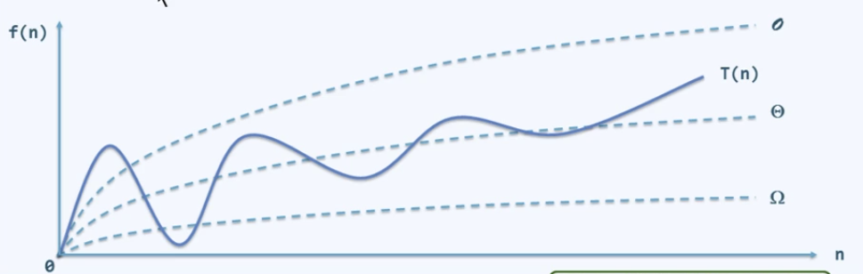
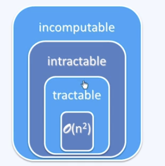
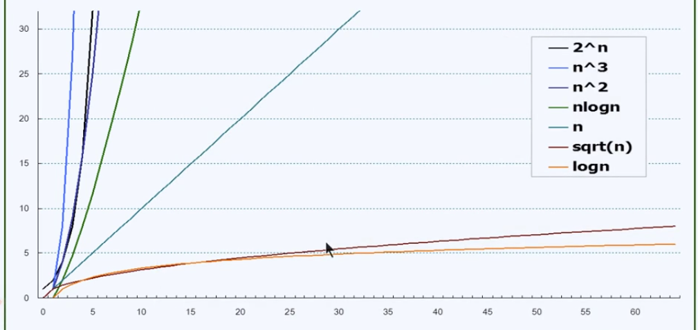
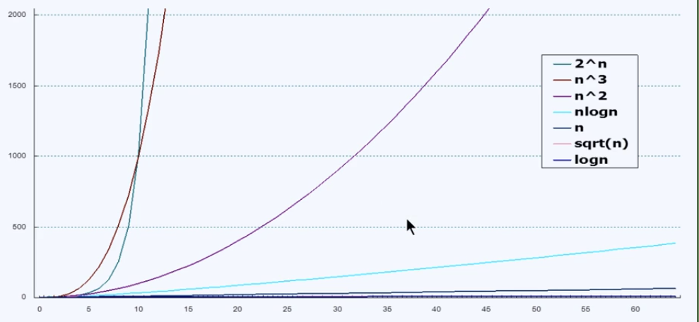

# 1. 绪论
## 1.1 计算

计算是找到 **对象的规律和技巧**，**目标是高效和低耗**。
### 1.1.1 计算工具
- 计算 = 信息处理
  借助某种工具，遵照一定规则，以明确而机械的形式进行。
- 计算模型 = 计算机 = 信息处理工具
### 1.1.2 算法
- 算法：特定计算模型下，解决特定问题的指令序列。
  - 输入  待处理的信息(问题)
  - 输出  经处理的信息(答案)
  - 正确性 确实可以解决指定的问题
  - 确定性 任何一个算法都可以描述一个有基本操作组成的序列
  - 可行性 每一个操作都可以实现，**且在常数时间内完成**
  - **有穷性** 对于任何输入，经有穷次基本操作，可以得到输出
    对于Hailstone(n)，序列，不确定对于任意n是否是有穷次，因此求Hailstone序列的程序不一定是算法。即 程序 != 算法。
- 好算法
  - 正确：符合语法，能编译、链接
  - 健壮：能辨别不合法的输入并做适当处理
  - 结构化 + 准确命名 + 注释
  - **效率：** 速度尽可能快；存储空间尽可能少
    算法 + 数据结构 = 程序
    (算法 + 数据结构) × 效率 = 算法

[Hailstone(n)的程序](chapter%2001/hailstone.cpp)
## 1.2 计算模型
### 1.2.1 性能分析
1) 引入 **理想、统一、分层次的**的尺度
2) 运用该尺度分析DSA(Data Sturcture Algorithm)的性能
### 1.2.2 算法分析
- 特定算法 + 特定实例
  - 两个主要方面：
    - 正确性
    算法功能与问题要求是否一致
    数学证明
    -  **成本** 
    运行时间 + 所需存储空间
    如何度量?如何比较？
  - 考察$T_A(P) = 算法A求解实例P的计算成本$
    意义不大，出现的问题实例太多
    归纳概括： **划分等价类**
  - 观察： 问题实例的 **规模**，往往决定计算成本
    规模越大，成本越高
- 特定算法 + 不同实例
  - 令$T_A(n) = 用算法A求解某一问题规模为n的实例，所需计算成本$
  - 观察，同一问题等规模的不同实例，计算成本不尽相同
  - T(n) = max {T(P) | |P| = n}
    在规模为n的所有实例中，只成本最高者
- 特定问题 + 不同算法
  - 同一问题不同算法，评判优劣
    - 实验统计，不可行
    - 抽象出一个虚拟的模型
### 1.2.3 图灵机模型(Turing Machine)
- Tape
  依次均匀的划分为单元格
  各注有某一字符，默认为'#'
- Alphabet
  字符种类有限
- Head
  总是对准某一单元格，并可读取和改写其中的字符
  每经过一个节拍，可转向左侧或右侧的邻格
- State
  TM总是处于有限状中的某一种
  每经过一个街拍，可(按照规则)转向另一种状态
- Transition Function:(q, c; d, L/R, p)
  若当前状态为q且当前字符为c，则将当前字符改为d
  一旦转入特定的状态'h'，则停机
- 启动至停机，所经历的节拍数
- 规范 ～ 接口
### 1.2.3 RAM(Random Access Machine)
- 寄存器顺序编号，总数没有限制
- 每一基本操作仅需常数时间
- 可通过编号访问任意寄存器
- 与TM模型一样，RAM模型也是一般计算工具的简化与抽象
  我们可以独立于具体的平台，对算法的效率做出可信的比较与评判
- 在这些模型中
  算法的运行时间 正比于 算法需要执行的基本操作次数
  T(n) = 算法为求解规模为n的问题，所需执行的基本操作次数
- 执行过程 记录为一张表
  表的行数 所执行基本指令的总条数

## 1.3 渐进复杂度
- 这里注重的是考察成本的增长趋势
- 渐进分析：问题规模足够大后，计算成本如何增长
  需执行的基本操作次数T(n)
- 大O记号(big-$O$ notation)
  Tn = $O$(f(n))
- 与T(n)相比，f(n)更为简洁，但依然反映前者的增长趋势，反映最差情况
- 其他记号
  $T(n) = \Omega(f(n))$下界
  $T(n) = \Theta(f(n))$近似
  
- $O:constant$
  - 常数：2 = 2013 = 2013 x 2013 = $O(1)$
  - 这类算法效率最高，通常不含转向(循环、调用、递归等),必顺序执行
- $O(log_c n)$
  - $O(logn)$常底数无所谓、常数次幂无所谓
  - 对数多项式
  - $\Theta(log^{321}n) = 123 × log^{321}n$
  - 无限接近常数复杂度，非常有效
- 多项式(polynomial function)
  - $O(n^k)$
  - 线性：$O(n)$类函数
  - 从$O(n)到O(n^2)$：课程练习主要覆盖的范围
  - 这类算法的效率认为 **已可** 令人满意
- 指数(expoential function):$T(n) = a^n$
  - 这类算法成本增加极快，通常认为不可忍受
  
- 2-Subset:NPC
  - 复杂度是$2^n$
  - 定理：$|2^S| = 2^S = 2^n
  - 直觉算法需要迭代$2^n$轮，最坏情况下至少花费这么多时间
  - 该直接算法就目前而言，就是最优算法
- 增长速度
  
  
## 1.4 复杂度分析
- 算法分析
  - 两个主要任务 = 正确性(不变性 × 单调性) + 复杂度
  - 不需要统计RAM基本指令的总数
  - C++等高级语言的基本指令，均等效于数条RMA基本指令，在渐进意义上，两者相当
    - 分支转向：goto //算法的灵魂；为结构化而被隐藏了
    - 迭代循环：for()、while()、...//本质就是if + goto
    - 调用 + 递归(自我调用)//本质上是goto
  - 主要方法：
    - 迭代(级数求和)
    - 递归(递归跟踪 + 递推方程)
    - 实用(猜测 + 验证)
- 级数
  - 算术级数：与**末项平方**同阶$T(n) = 1 + 2 + ... + n = O(n^2)$
  - 幂方级数：比幂次高出一阶$\sum^{n}_{k=0}k^n \approx \int_0^nx^ddx = O(d^{n+1})$
  - 几何级数：与末项同阶
    $T_a(n) = \sum_{k=0}^na^k = a^0 + a^1 + a^2 + ... + a^n = O(a^n)$
  - 几何分布：$(1-\lambda) × [1 + 2\lambda + 3\lambda^2 + 4\lambda^3 + ...] = 1/(1-\lambda) = O(1)$
  - 不收敛但有限
    - 调和级数：$h(n) = \sum^n_{k=1}\frac{1}{k} = 1 + \frac{1}{2} + \frac{1}{3} + ... + \frac{1}{n} = lnn + \gamma + O(\frac{1}{2n} = \Theta(logn)$
    - 对数级数：$\sum^n_{k=1}lnk \approx\Theta(nlogn)$
    - 对数 + 线性：$\sum^n_{k=1}klogk \approx O(n^2logn)$
    - $\sum^n_{k=1}k*2^k = O(n*2^n)$
  - 迭代 + 算数级数 $O(n^2)$
  - 迭代 + 复杂级数
- 正确性实例：
  以冒泡排序为例：
  不变性：经过k轮扫描后，k个最大元素必然就位
  单调性：经过k轮扫描后，问题规模缩小至n-k
  正确性：经过n轮扫描后，算法必然终止，且实现排序功能
- 封底估算——定量估算，即近似计算
  - 1天 = 24hr × 60min × 60sec = 10^5 sec
  - 1生 = 1世纪 = 100year × 365 = 3 × 10^9

## 1.5 迭代与递归
- 减而治之
  - 迭代乃人工，递归方神通
  - 将原问题(n)划分为两个子问题：平凡子问题(1)缩减子问题(n-1)//单调性
  - 分别求解子问题；再由子问题的解，得到原问题的解
  [减而治之递归](chapter01/DecreaseandConquer/reverse.cpp)
- 分而治之 Divide-and-Conquer
  - 为求解一个大规模的问题，可以
    将其划分为若干个(通常两个)子问题，规模大体相当
    分别求解子问题
    由子问题的解，得到原问题的解
  [分而治之递归](chapter01/maxtwo/max2_Divide.cpp)

## 1.6 动态规划
- 动态规划：记忆法
  momoization
- 求解fib问题：
  - fib的递归解法，复杂度为O(2^n),速度慢。[Fib递归算法](chapter01/Fibonacci/fib.cpp)
  - 之所以fib的递归解法的速度慢，是因为其中存在大量的重复运算，因此可以使用一个数组来记录计算结果，每次递归计算前首先从数组中查询，若该结果已被记录，则直接返回数组中的结果。[Fib-Memoization法](chapter01/Fibonacci/fib.cpp)
  - 前两种递归方法都是从问题规模n向规模1发展，是自顶向下的方法，动态规划的方法更适合自底向上的方法，该方法与递归方法相比，不存在频繁的函数调用，因此效率更高。[Fib-自底向上DP法](chapter01/Fibonacci/fib.cpp)

- 求解LCS问题
  LCS问题，即求解两个字符串的最长公共子序列，序列意味着求得的结果在字符串中不是连续的。
  - 递归解
  对于这个问题，可以将子问题的自然分类对应两个输入序列的前缀。即，从尾部出发，针对不同的情况去掉尾部的元素，将问题的规模缩小。存在两种情况，如果两个字符串的尾部元素相等，则最长公共子序列长度+1,同时研究去掉尾部元素的前缀问题，若尾部元素不相等，采用分而治之的办法，转换成两个问题：计算去掉第一个字符串尾部元素的字符串与第二个字符串的最长公共子序列长度和计算第一个字符串与去掉第二个字符串的尾部元素的字符串的最长公共子序列长度，结果应该是两个计算结果中较大的那个。[LCS减而递之+分而递之法](chapter01/LCS/LCS_RDD.cpp)
  - 动态规划法
    第一种方法存在大量的重复计算，其时间复杂度为指数复杂度，但是LCS问题只有$\Theta$(mn)个子问题，因此可以使用动态规划法来优化上述的指数复杂度算法。可以将每个子问题的结果保存到一个二维数组c[i][j]中，按照行的主次序来计算表项。生成的c[m][n]保存了X和Y的LCS的长度。[LCS动态规划法，从底向上](chapter01/LCS/LCS_DP.cpp)
  - 动态规划法的改进，动态规划法的实现。动态规划法需要一个DP数组，其空间复杂度为O(mn)，存储对应的子问题的长度，时间复杂度变为O(mn),通过观察DP数组的内容发现，对于两个字符串相等的字符，我们可以记录该字母在两个字符串中出现的位置和，和最小的字符即为该字符，在从搜索字符串中剩余的字符，直到搜索不到相同的字符，循环停止。[LCS动态规划算法改进](chapter01/Homework/LCS15.4/LCS_DP_improve.cpp)